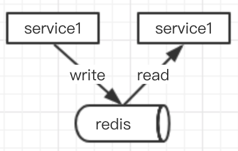
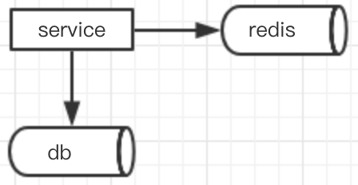
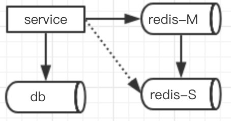
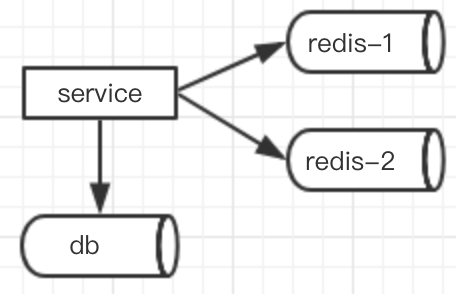
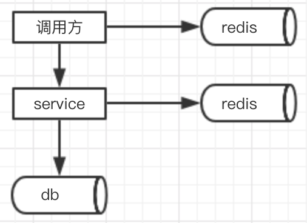
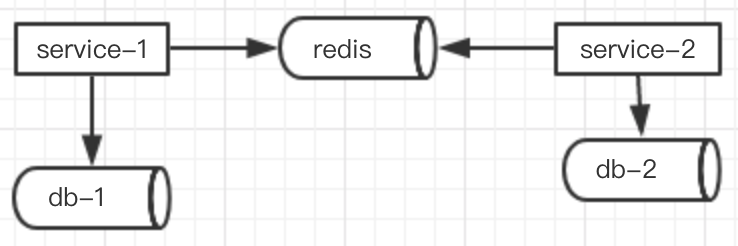

# 缓存，你真的用对了么？

缓存，是互联网分层架构中，非常重要的一个部分，通常用它来**降低数据库压力，提升系统整体性能，缩短访问时间**。

有架构师说“缓存是万金油，哪里有问题，加个缓存，就能优化”，缓存的滥用，可能会导致一些错误用法。

缓存，你真的用对了么？

+ **误用一：把缓存作为服务与服务之间传递数据的媒介**

如上图：  
  1.服务1和服务2约定好key和value，通过缓存传递数据  
  2.服务1将数据写入缓存，服务2从缓存读取数据，达到两个服务通信的目的

该方案存在的问题是：  
  1.数据管道，数据通知场景，MQ更加适合  
  2.多个服务关联同一个缓存实例，会导致服务耦合

+ **误用二：使用缓存未考虑雪崩**

常规的缓存玩法，如上图：  
  1.服务先读缓存，缓存命中则返回  
  2.缓存不命中，再读数据库

**什么时候会产生雪崩？**  
答：如果缓存挂掉，所有的请求会压到数据库，如果未提前做容量预估，可能会把数据库压垮（在缓存恢复之前，数据库可能一直都起不来），导致系统整体不可服务。

**如何应对潜在的雪崩？**  
答：提前做容量预估，如果缓存挂掉，数据库仍能扛住，才能执行上述方案。  
否则，就要进一步设计。  

**常见方案一：高可用缓存**

如上图：使用高可用缓存集群，一个缓存实例挂掉后，能够自动做故障转移。

**常见方案二：缓存水平切分**

如上图：使用缓存水平切分，一个缓存实例挂掉后，不至于所有的流量都压到数据库上。

**误用三：调用方缓存数据**

如上图：  
  1.服务提供方缓存，向调用方屏蔽数据获取的复杂性（这个没问题）  
  2.服务调用方，也缓存一份数据，先读自己的缓存，再决定是否调用服务（这个有问题）  

该方案存在的问题是：  
  1.调用方需要关注数据获取的复杂性  
  2.更严重的，服务修改db里的数据，淘汰了服务cache之后，难以通知调用方淘汰其cache里的数据，从而导致数据不一致  
  3.有人说，服务可以通过MQ通知调用方淘汰数据，额，难道下游的服务要依赖上游的调用方，分层架构设计不是这么玩的

**误用四：多服务共用缓存实例**

如上图：  
服务A和服务B共用一个缓存实例（不是通过这个缓存实例交互数据）  

该方案存在的问题是：  
  1.可能导致key冲突，彼此冲掉对方的数据  
  > 画外音：可能需要服务A和服务B提前约定好了key，以确保不冲突，常见的约定方式是使用namespace:key的方式来做key。  

  2.不同服务对应的数据量，吞吐量不一样，共用一个实例容易导致一个服务把另一个服务的热数据挤出去  
  3.共用一个实例，会导致服务之间的耦合，与微服务架构的“数据库，缓存私有”的设计原则是相悖的  

建议的玩法是：

如上图：各个服务私有化自己的数据存储，对上游屏蔽底层的复杂性。

+ **总结**

缓存使用小技巧：  
  1.服务与服务之间不要通过缓存传递数据  
  2.如果缓存挂掉，可能导致雪崩，此时要做高可用缓存，或者水平切分  
  3.调用方不宜再单独使用缓存存储服务底层的数据，容易出现数据不一致，以及反向依赖  
  4.不同服务，缓存实例要做垂直拆分  
