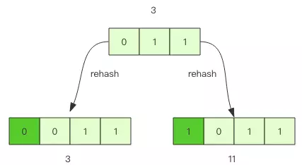
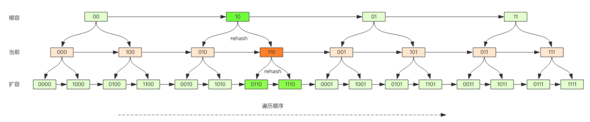

# Scan
---
在平时线上Redis维护工作中，有时需要从Redis实例成千上万的key中找出特定前缀的key列表来处理数据可能是修改它的值，也可能是删除key。这里就有一个问题，如何从海量的key中找出满足特定前缀的key列表来？

Redis提供了简单暴力的keys指令，用来列出所有满足所有特定正则字符串规则的key。
```
127.0.0.1:6379> set codehole1 a
OK
127.0.0.1:6379> set codehole2 b
OK
127.0.0.1:6379> set codehole3 c
OK
127.0.0.1:6379> set code1hole a
OK
127.0.0.1:6379> set code2hole b
OK
127.0.0.1:6379> set code3hole b
OK
127.0.0.1:6379> keys *
1) "codehole1"
2) "code3hole"
3) "codehole3"
4) "code2hole"
5) "codehole2"
6) "code1hole"
127.0.0.1:6379> keys codehole*
1) "codehole1"
2) "codehole3"
3) "codehole2"
127.0.0.1:6379> keys code*hole
1) "code3hole"
2) "code2hole"
3) "code1hole"
```

这个指令非常简单，提供一个简单的正则字符串即可，但是有很明显的两个缺点：
+ 没有offset、limit参数，一次性吐出所有满足条件的key，万一实例中有几百万个key满足条件，当你看到满屏的字符串刷的没有尽头时，你就知道难受了。  
+ keys算法是遍历算法，复杂度是O(n)，如果实例中有千万级以上的key，这个指令就会导致Redis服务卡顿，所有读写Reids的其它指令都会被延后甚至会超时报错，因为Redis是单线程程序，顺序执行所有指令，其它指令必须等到当前的keys指令执行完了才可以继续。

面对着2个显著的缺点该怎么办呢？

Redis为了解决这个问题，它在2.8版本中加入了大海捞针的指令-`scan`。`scan`相比`keys`具备有一下特点：
+ 复杂度虽然也是O(n)，但是它是通过游标分步进行的，不会阻塞线程
+ 提供limit参数，可以控制每次返回结果的最大条数，limit只是一个limit，返回的结果可多可少
+ 同keys一样，它也提供模式匹配功能
+ 服务器不需要为游标保存状态，游标的唯一状态就是scan返回给客户端的游标整数
+ 返回的结果可能会有重复，需要客户端去重，这点非常重要
+ 遍历的过程中如果有数据修改，改动后的数据能不能遍历到时不确定的
+ 单词返回的结果时空的并不意味着遍历结束，而要看返回的游标值是否为0

## scan基础使用
---
在使用之前，让我们往Redis里面插入10000调数据进行测试
```
import redis

client = redis.StrictRedis()
for i in range(10000):
    client.set("key%d" % i, i)
```

好，Redis 中现在有了 10000 条数据，接下来我们找出以 key99 开头 key 列表。

scan指令提供了3个参数，第一个时cursor整数值，第二个时key的正则表达式，第三个时遍历的limit hint。第一次遍历时，cursor值为0，然后将返回结果中第一个整数值作为下一次遍历的cursor，一直遍历到返回的cursor值为0时结束。

```
127.0.0.1:6379> scan 0 match key99* count 1000
1) "13976"
2)  1) "key9911"
    2) "key9974"
    3) "key9994"
    4) "key9910"
    5) "key9907"
    6) "key9989"
    7) "key9971"
    8) "key99"
    9) "key9966"
   10) "key992"
   11) "key9903"
   12) "key9905"
127.0.0.1:6379> scan 13976 match key99* count 1000
1) "1996"
2)  1) "key9982"
    2) "key9997"
    3) "key9963"
    4) "key996"
    5) "key9912"
    6) "key9999"
    7) "key9921"
    8) "key994"
    9) "key9956"
   10) "key9919"
127.0.0.1:6379> scan 1996 match key99* count 1000
1) "12594"
2) 1) "key9939"
   2) "key9941"
   3) "key9967"
   4) "key9938"
   5) "key9906"
   6) "key999"
   7) "key9909"
   8) "key9933"
   9) "key9992"
......
127.0.0.1:6379> scan 11687 match key99* count 1000
1) "0"
2)  1) "key9969"
    2) "key998"
    3) "key9986"
    4) "key9968"
    5) "key9965"
    6) "key9990"
    7) "key9915"
    8) "key9928"
    9) "key9908"
   10) "key9929"
   11) "key9944"
```

从上面的过程可以看到虽然提供的 limit 是 1000，但是返回的结果只有 10 个左右。因为这个 limit 不是限定返回结果的数量，而是限定服务器单次遍历的字典槽位数量(约等于)。如果将 limit 设置为 10，你会发现返回结果是空的，但是游标值不为零，意味着遍历还没结束。

```
127.0.0.1:6379> scan 0 match key99* count 10
1) "3072"
2) (empty list or set)
```

## 字典的结构
---
在Redis中所有的key都存储在一个很大的字典中，这个字典的结构和Java中的HashMap一样，时一维数组+二维链表结构，第一位数组的大小总是2^n(n>=0)，扩容一次数组大小空间加倍，也就是n++。


scan指令返回的游标就是第一位数组的位置索引，我们将这个索引成为槽（slot）。如果不考虑字典的扩容缩容，直接按数组下标挨个遍历就行了。limit参数就标识需要遍历的槽位数，之所以返回的结果可能多可能少，是因为不是所有的槽位上都会挂接链表，有些槽位可能是空的，还有写槽位上挂接的链表的元素可能会有多个。每一次遍历都会将limit数量的槽位上挂接的所有链表的元素进行模式匹配过滤后，一次性返回给客户端。

## scan遍历顺序
---
scan的遍历顺序非常特别，它不是从第一位数组的第0位一直遍历都末尾，而是采用了高位进位加法来遍历。之所以使用这样特殊的方式进行遍历，是考虑到字典的扩容和缩容时避免避免槽位的遍历重复和遗漏。

高位高位进位发从左边加，进位往右边移动，同普通假发正好想法。但是最终他们都会遍历所有的槽位并且没有重复。

## 字典扩容
---
Java中的HashMap有扩容的概念，当loadFactor达到阈值时，需要重新分配一个新的2倍大小的数组，然后将所有的元素全部rehash挂到新的数组下面。rehash就是将元素的hash值对组长度进行取模运算，因为长度变了，所以每个元素挂接的槽位可能也发生了变化，又因为数组长度是2^n，所以取模运算等价于位与操作。
```
a mod 8 = a & (8-1) = a & 7
a mod 16 = a & (16-1) = a & 15
a mod 32 = a & (32-1) = a & 31
```
这里的7、15、31称之为字典的mask值，mask的作用就是保留字典的最低位，高位都被设置为0.

接下来我们看看rehash前后元素槽位的变化。

假如当前的字典的数组长度由8位扩容到16位，那么3号槽位011上的元素将被rehash到3号槽位或11号槽位，也就是说该槽位链表中大约有一半的元素还是3号槽位，其它的元素会放到11号槽位，11这个数字的二进制是1011，就是对3的二进制011增加了一个高位1.



抽象一点说，假设开始槽位的二进制数是xxx，那么该槽位中的元素将被rehash到0xxx和1xxx(xxx+8)中。如果字典长度由16扩容到32，那么对于二进制槽位xxxx中的元素将被rehash到0xxxx和1xxxx(xxxx+16)中

## 对比扩容缩容前后的



观察这张图，我们发现采用改为进位加法的遍历顺序，rehash后槽位再遍历顺序上是相邻的。

假设当前即将要遍历110这个位置（橙色），那么缩容后，当前槽位所有的元素对应的新槽位是10（深绿色），也就是去掉槽位二进制最高位。这时我们可以继续从10这个槽位上继续往后遍历，10槽位之前的所有槽位都是已经遍历过的，这样就可以避免缩容的重复遍历。不过缩容还是不太一样，它会对图中010这个槽位上的元素进行重复遍历，因为缩容后10槽位的元素是010和110上挂接的元素的融合。

## 渐进式rehash
---
Java的HashMap再扩容时会一次性将旧数组下挂接的元素全部转移到新数组下面。如果HashMap中元素特别多，线程就会出现卡顿现象。Redis为了解决这个问题，它采用了渐进式rehash。

它会同时保留旧数组和新数组，然后在定时任务中以及后续对hash的指令操作中渐渐的将旧数组下挂接的元素迁移到新数组上。这意味着要操作处于rehash中的字典，需要同时访问新旧两个数组结构。如果在旧数组下面找不到元素，还需要去新数组下面寻找。

scan也需要考虑这个问题，对于rehash中的字典，它需要同时扫面新旧槽位，然后将结果融合后返回给客户端。

## 更多scan指令
---
scan指令时一系列指令，除了可以遍历所有的key之外，还可以对指定的容器集合进行遍历。比如zscan遍历zset集合，hscan遍历hash字典的元素，sscan遍历set集合的元素。

它们的原理同scan都是类似的，因为hash底层就是字典，set也是一个特殊的字典（所有的value指向同一个元素），zset内部也使用了字典来存储所有的元素内容，所以这里不再赘述。

## 大Key扫描
---
有时候会因为业务人员使用不当，在Redis实例中会形成很大的对象，比如一个很大的hash，一个很大的zset这都是经常出现的。这样的对象对Redis的集群数据迁移带来了很大的问题，因为在集群环境下，如果某个key太大，会导致迁移卡顿。另外在内存分配上，如果一个key太大，那么当它需要扩容时，会一次性申请更大的一块内存，这也会导致卡顿。如果这个大key被删除，内存会一次性回收，卡顿现象会再一次产生。

**在平时的业务开发中，要尽量避免大key的产生**

如果你观察到 Redis 的内存大起大落，这极有可能是因为大 key 导致的，这时候你就需要定位出具体是那个 key，进一步定位出具体的业务来源，然后再改进相关业务代码设计。

**那如何定位大 key 呢？**  

为了避免对线上 Redis 带来卡顿，这就要用到 scan 指令，对于扫描出来的每一个 key，使用 type 指令获得 key 的类型，然后使用相应数据结构的 size 或者 len 方法来得到它的大小，对于每一种类型，保留大小的前 N 名作为扫描结果展示出来。

上面这样的过程需要编写脚本，比较繁琐，不过 Redis 官方已经在 redis-cli 指令中提供了这样的扫描功能，我们可以直接拿来即用。
```
redis-cli -h 127.0.0.1 -p 7001 –-bigkeys
```
如果你担心这个指令会大幅抬升 Redis 的 ops 导致线上报警，还可以增加一个休眠参数。
```
redis-cli -h 127.0.0.1 -p 7001 –-bigkeys -i 0.1
```
上面这个指令每隔 100 条 scan 指令就会休眠 0.1s，ops 就不会剧烈抬升，但是扫描的时间会变长。

[扩展阅读](https://mp.weixin.qq.com/s/ufoLJiXE0wU4Bc7ZbE9cDQ)