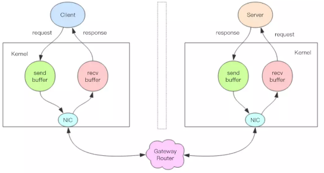
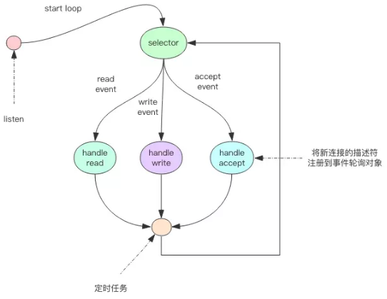

# 线程IO模型

**Redis是个单线程程序！**  

也许你会怀疑告并发的Redis中间件怎么可能是单线程。很抱歉，它就是单线程。除了Redis之外，NodeJs也是单线程，Nginx也是单线程，但是他们都是服务器高性能的典范。

**Redis单线程为什么还能这么快**

因为它所有的数据都在内存中，所有的运算都是内存级别的运算。正因为Redis是单线程，所以要小心使用Redis指令，对于那些时间复杂度为O(N)级别的指令，一定要小心谨慎使用，一不小心就可能导致Redis服务卡顿。

**Redis单线程如何处理那么多的并发客户端链接？**

多路复用

## 非阻塞IO
---
当我们调用套接字的读写方法，默认他们是阻塞的，比如read方法要传进去一个参数n，表示最多读取这么多字节后再返回，如果一个字节都没有，那么线程就会卡在那里，直到新的数据到来或者链接关闭了，read方法才可以返回，线程才能继续处理。而write方法一般来说不会阻塞，除非内核为套接字分配的写缓冲区已经满了，write方法就会阻塞，直到缓冲区中有空闲空间挪出来。

非阻塞IO在套接字对象上提供了一个选项Non_Blocking，当这个选项打开时，读写方法不会阻塞，而是能读多少就读多少，能写多少就写多少。能读多少取决于内核为套接字分配的读缓冲区内部的数据字节数。读方法和写方法都会通过返回值来告知程序实际读写了多少字节。

## 事件轮询（多路复用）
---
非阻塞IO有个问题，那就是线程要读数据，结果读了一部分就返回了，线程如何知道何时才能继续读。也就是当数据到来时，线程如何得到通知。写也是一样，如果缓冲区满了，写不完，剩下的数据何时才能继续写，线程也应该得到通知。

时间轮询API就是用来解决这个问题的，最简单的事件轮询API是select函数，它是操作系统提供给用户程序的API。现在操作系统的多路复用API已经不再使用select系统调用，而是改用epoll(linux)和kqueue(freebsd & macosx)，因为select系统调用的性能在描述符特别多时性能会非常差。他们使用起来可能在形式上略有差异，但是本质上都是差不多的，都可以使用上面的伪代码逻辑进行理解。

服务器套接字serversocket对象的读操作是指调用accept接受客户端新连接。何时有新连接到来，也是通过select系统调用的读事件来得到通知的。

**事件轮询API就是Java语言里面的NIO技术**

Java 的 NIO 并不是 Java 特有的技术，其它计算机语言都有这个技术，只不过换了一个词汇，不叫 NIO 而已。

## 指令队列
---
Redis会将每个客户端套接字都关联一个指令队列。客户端的指令通过队列来排队进行顺序处理，先到先服务。

##　响应队列
---
Redis同样也会为每个客户端套接字关联一个响应队列。Redis服务器通过响应队列来将指令的返回结果回复给客户端。如果队列为空，那么意味着连接暂时处于空闲状态，不需要去获取读写事件，也就是可以将当前的客户端描述符从write_fds里面移出来。等到队列有数据了，再将描述符放进去。避免select系统调用立即返回写事件，结果发现没什么数据可以写。出这种情况的线程会飙高 CPU。

＃＃　定时任务
---
服务器处理要响应ＩＯ事件外，还要处理其它事情。比如定时任务就是非常重要的一件事。如果线程阻塞在ｓｅｌｅｃｔ系统调用上，定时任务将无法得到准时调度。那Redis是如何解决这个问题的呢？

Redis的定时任务会记录在一个称为最小堆的数据结构中。这个堆中，最快要执行的任务排在堆的最上方。在每个循环周期内，Redis都会将最小堆里面已经到点的任务立即进行处理。处理完毕后，将最快要执行的任务还需要的时间记录下来，这个时间就是select系统调用的timeout参数。因为Redis知道未来timeout时间内，没有其他定时任务需要处理，所以可以安心睡眠timeout时间。

