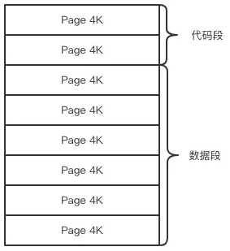
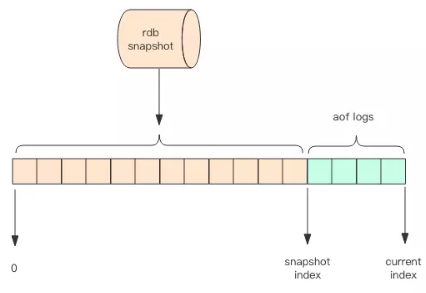

# 持久化
---
Redis的数据全部在内存里，如果突然宕机，数据就会全部丢失，因此必须有一种机制来保证Redis的数据不会因为故障而丢失，这种机制就是Redis的持久化机制。

Redis的持久化机制有2种，一种是快照，另一种是AOF日志。快照是一次全量备份，AOF日志是连续的增量备份。快照是内存数据的二进制序列化形式，在存储上非常紧凑，而AOF日志记录的是内存数据修改的指令记录文本。AOF日志在长期的运行过程中会变得无比庞大，数据库重启时需要加载AOF日志进行指令重放，这个时间就会无比漫长。所以需要定期进行AOF重写，给AOF日志进行瘦身。


## 快照原理
---
我们知道Redis是单线程程序，这个线程要同时负责多个客户端套接字的并发读写操作和内存数据结构的逻辑读写。

在服务线上请求的同时，Redis还需要进行内存快照，内存快照要求Redis必须进行IO操作，可文件IO操作是不能使用多路复用API的。

这意味着单线程同事在服务线上的请求还要进行文件IO操作，文件IO操作会严重拖垮服务器请求的性能。还有个重要问题是，为了不阻塞线上的业务，就需要边持久化边响应客户端的请求。持久化的同时，内存数据结构还在变化，比如一个大型的hash字典正在持久化，结果一个请求过来把它给删掉了，还没有持久化完呢，这尼玛要怎么搞？

Redis使用操作系统的多进程COW(Copy On Write)机制来实现快照持久化。

## fork(多进程)
---
Redis在持久化时会调用glibc的函数fork产生一个子进程，快照持久化完全交给子进程来处理，父进程继续处理客户端请求。子进程刚刚产生时，它和父进程共享内存里的代码段和数据段。这时你可以将父子进程想象成一个连体婴儿，共享身体。这时linux操作系统的机制，为了节约内存资源，所以尽可能让他们共享起来。在进程分离的一瞬间，内存的增长几乎没有明显变化。


用python语言描述进程分离的逻辑如下。fork函数会在父子进程同时返回，在父进程里返回子进程的pid，在子进程里返回零。如果操作系统内存资源不足，pid就会是负数，表示fork失败。
```
pid = os.fork()
if pid > 0:
    handle_client_requests()  # 父进程继续处理客户端请求
if pid == 0:
    handle_snapshot_write()  # 子进程处理快照写磁盘
if pid < 0:
    # fork error
```
子进程做数据持久化，它不会修改现有的内存数据结构，它只是对数据结构进行遍历读取，然后序列化写到磁盘中。但是父进程不一样，它必须持续服务客户端请求，然后对内存数据结构进行不间断的修改。

这个时候就会使用操作系统的COW机制来进行数据段页面的分离。数据段是由很多操作系统的页面组合而成，当父进程对其中一个页面进行修改时，会将被共享的页面复制一份分离出来，然后对这个复制的页面进行修改。这时子进程相应的页面是没有变化的，还是进程产生时那一瞬间的数据.



随着父进程修改操作的持续进行，越来越多的共享页面被分离出来，内存就会持续增长。但也不会超过原有数据内存的2倍大小。另外一个Redis实例里冷数据占的比例往往是比较高的，所以很少会出现所有的页面都会被分离，被分离的往往只是其中一部分页面。每个页面的大小只有4K，一个Redis实例里面一般都会有成千上万的页面。

子进程因为数据没有变化，它能看到的内存里的数据在进程产生的一瞬间就凝固了，再也不会变化，这也是Redis的持久化叫快照的原因。接下来子进程就可以非常安心的遍历数据进行序列化写磁盘了。


## AOF原理
---
AOF日志存储的是Redis服务器的顺序指令序列，AOF日志只记录对内存数据进行修改的指令。

假设AOF日志记录了自Redis实例创建以来所有的修改指令序列，那么就可以通过对一个空的Redis实例顺序执行所有的指令，也就是【重放】，来恢复Redis当前实例的内存数据结构的状态。

Redis会在收到客户端修改指令后，进行参数校验逻辑处理，如果没有问题，就立即将该指令文本存储到AOF日志中，也就是先执行指令才将日志存盘。这点不同于leveldb、hbase等存储引擎，他们都是先存储日志再做逻辑处理。

Redis在长期的运行过程中，AOF日志会变得越来越长。如果实例宕机重启，重放整个AOF日志会非常耗时，导致Redis长时间无法对外提供服务。所以需要对AOF日志进行瘦身。


## AOF重写
---
Redis提供了`bgrewriteaof`指令用于对AOF日志进行瘦身。其原理就是开辟一个子进程对内存进行遍历转换成一系列Redis的操作指令，序列化到一个新的AOF日志文件中。序列化完毕后再将操作期间的增量AOF日志追加到这个新的AOF日志文件中，追加完毕后就立即替代旧的AOF日志文件，瘦身工作就完成了。


## fsync
---
AOF是以文件的形式存在的，当程序对AOF日志进行写操作时，实际上是将内容写到了内核为文件描述符分配的一个内存缓存中，然后内核会异步将脏数据刷回到磁盘的。

这就意味这机器如果突然宕机，AOF日志内容可能还没有来得及完全刷到磁盘中，这个时候就会出现日志丢失。那该怎么办？

Linux的`glibc`指令提供了`fsync(int fd)`函数可以将指定文件的内容强制从内核缓存刷到磁盘。只要Redis进程实时调用`fsync`函数就可以保证AOF日志不丢失。但是fsync是一个磁盘io操作，它很慢！如果fsync执行一条指令就要fsync一次，那么Redis高新能的地位就不保了。

所以在生产环境的服务器中，Redis、通常每隔1秒实行一次fsync操作，周期1s是可以配置的。这是在数据安全性和性能之间做了一个折中，在保持高性能的同时，尽可能是的数据少丢失。

Redis同样也提供了另外2中策略，一个是用不fsync，让操作系统来决定何时同步磁盘，很不安全，另一个是来一个指令就fsync一次，非常慢。但是在生产环境基本不会使用。


## 运维
---
快照是通过开启子进程的方式进行的，它是一个比较耗资源的操作。
+ 遍历整个磁盘，大块写磁盘会加重系统负载。
+ AOF的fsync是一个耗时的IO操作，它会降低Redis性能，同时也会增加系统IO负担

所以通常Redis的主节点是不会进行持久化操作，持久化操作主要在从节点进行。从节点是备份节点，没有来自客户端请求的压力，它的操作系统资源往往比较充沛。

但是如果出现网络分区，从节点长时间连接不上从节点，就会出现数据不一致的问题，特别是在网络分区出现的情况下又不小心主节点宕机了，那么数据就会丢失，所以在生成环境要做好实时监控工作，保证网络通常或者能快速修复。另外还应该再增加一个从节点以降低网络分区的概率，只要有一个从节点数据同步正常，数据也不会轻易丢失。

 
##  Redis4.0混合持久化
---
重启Redis时，我们很少使用rdb来回复内存状态，因为会丢失大量数据。我们通常会使用AOF日志重放，但是重放AOF日志性能相对rdb来说要慢很多，这样在Redis实例很大的情况下，启动需要花费很长的时间。

Redis4.0为了解决这个问题，带来了一个新的持久化选项——混合持久化。将rdb文件的内容和增量的AOF日志文件存在一起。这里的AOF不再是全量的日志，而是自持久化开始到持久化结束的这段时间发生的AOF日志，通常这部分AOF日志很小。



于是在 Redis 重启的时候，可以先加载 rdb 的内容，然后再重放增量 AOF 日志就可以完全替代之前的 AOF 全量文件重放，重启效率因此大幅得到提升。