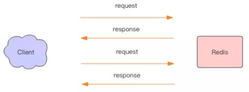
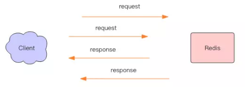
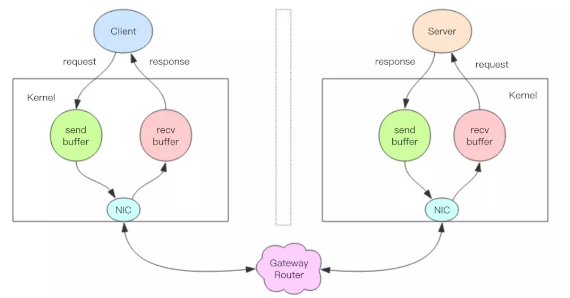

# 管道
---
Redis管道本身并不是Redis服务器直接提供的技术，这个技术本质上是由客户端提供的，跟服务器没有什么直接的关系。下面对这一块做一个深入探究。

## Redis的消息交互
---
当我们使用客户端对Redis进行一次操作时，如下图所示，客户端将请求传送给服务器，服务器处理完毕后，再将响应回复给客户端。这要话费一个网络数据包来回的时间。


如果连续执行多条指令，那就会话费多个网络数据包来回的时间。如下图：



回到客户端代码层面，客户端是经历了写-读-写-读4个操作才完整的执行了2条指令。


现在如果我们调整读写顺序，改成写-写-读-读，这2个指令同样可以正常完成。


两个连续的写操作和两个连续的读操作总共只会花费一次网络来回，就好比连续的写操作合并了，连续的读操作也合并了一样。



这便是管道操作的本质，服务器根本没有任何区别对待，还是收到一条消息，执行一条消息，回复一条消息的正常流程。客户端通过对管道中的指令列表改变读写顺序就可以大幅度节省IO时间。管道中指令越多，效果越好。


## 管道压力测试
---
接下来我们实践一下管道的力量。

Redis自带了一个压力测试工具`redis-benchmark`，使用这个工具就可以进行管道测试。

首先，我们对一个普通的set指令进行压测,QPS大约5w每秒
```
> redis-benchmark -t set -q
SET: 51975.05 requests per second
```

我们加入管道选项`-P`参数，它表示d按个管道内并行的q请求数量，看下面`P=2`,QPS达到了9w/s.
```
> redis-benchmark -t set -P 2 -q
SET: 91240.88 requests per second
```

再看看P=3，QPS 达到了 10w/s。
```
SET: 102354.15 requests per second
```

但如果再继续提升 P 参数，发现 QPS 已经上不去了。这是为什么呢？

因为这里CPU处理能力已经达到了瓶颈，Redis的单线程CPU已经达到了100%，所以无法再继续提升了。


## 深入理解管道本质
---
接下来我们深入分析一个请求交互的流程，真是的情况是它很复杂，因为要经过网络协议栈，这个j就得深入操作系统内核了。



上图就是一个完整的请求交互流程图:  
1.客户端进程d调用write将消息写到操作系统内核为套接字分配的发送缓冲`send buffer`。  
2.客户端操作系统内核将发送缓冲的内容发送到网卡，网卡硬件将数据通过[网际路由]送到服务器的网卡。  
3.服务器操作系统内核将网卡的数据放到内核为套接字分配的接收缓冲[recv buffer.  
4.服务器进程调用`read`从接收缓冲中去除消息进行处理。  
5.服务器进程调用`write`将响应消息写到内核为套接字分配的发送缓冲`send buffer`。  
6.服务器操作系统内核将发送缓冲的内容发送到网卡，网卡硬件将数据通过[网际路由]送到客户端的网卡。  
7.客户端操作系统内核将网卡的数据放到内核为套接字分配的缓冲区`recv buffer`.  
8.客户端进程调用`read`从接收缓冲中去除消息返回给上层业务逻辑进行处理。
9.结束。

我们开始以为`write`操作要等到对方接收到消息才返回，但实际上不是这样的。`write`操作只负责将数据写到本地操作系统内核的发送缓冲然后就返回了。剩下的事情交给操作系统内核异步将数据送到目标机器。但是如果发送缓冲满了，那么就需要等待缓冲空出空闲空间来，这个就是写操作 IO 操作的真正耗时。

我们开始以为`read`操作是从目标机器拉取数据，但实际上不是这样的。`read`操作只负责将数据从本地操作系统内核的接收缓冲中取出来就了事了。但是如果缓冲是空的，那么就需要等待数据到来，这个就是读操作 IO 操作的真正耗时。

所以对于`value = redis.get(key)`这样一个简单的请求来说，write操作几乎没有耗时，直接写到发送缓冲就返回，而`read`就会比较耗时了，因为它要等待消息经过网络路由到目标机器处理后的响应消息,再回送到当前的内核读缓冲才可以返回。这才是一个网络来回的真正开销。

而对于管道来说，连续的`write`操作根本就没有耗时，之后第一个`read`操作会等待一个网络的来回开销，然后所有的响应消息就都已经回送到内核的读缓冲了，后续的`read`操作直接就可以从缓冲拿到结果，瞬间就返回了。


