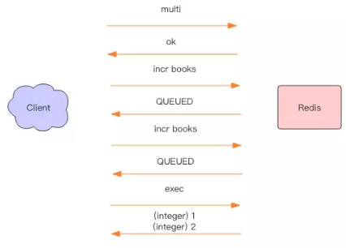

# 事务
---
为了确保连续多个操作的原子性，一个成熟的数据库通常都会有事务支持，Redis也不例外。Redis的事务使用非常简单，不同于关系数据库，我们无需理解那么多复杂的事务模型，就可以直接使用。不过也正是因为这种简单性，它的事务模型很不严格，这要求我们不能像使用关系数据库的事务一样使用Redis。


## Redis事务的基本使用
---
每个事务的操作都有begin，commit和rollback，begin指示事务的开始，commit指示事务的提交，rollback指示事务的回滚。它的大致形式如下：
```
begin();
try {
    command1();
    command2();
    ....
    commit();
} catch(Exception e) {
    rollback();
}
```
Redis在形式上看起来也差不多，分别是multi、exec、discard。multi指示事务开始，exec指示事务执行，discard指示事务丢弃。
```
> multi
OK
> incr books
QUEUED
> incr books
QUEUED
> exec
(integer) 1
(integer) 2
```
上面的指令演示了一个完整的事务过程，所有的指令在exec之前不执行，而是缓存在服务器的一个事务队列中，服务器一旦收到exec指令，才开始执行整个事务队列，执行完毕后一次性返回所有指令的运行结果。因为Redis的单线程特性，它不用担心自己在执行队列的时候被其它指令打搅，可以保证它们能得到[原子性]执行。



上图显示了以上事务完整的交互过程。QUEUED十一个简单的字符串，同OK是一个形式，它表示指令已经被服务器缓存到队列里了。


## 原子性
---
事务的原子性是指事务要么全部成功，要么全部失败，那么Redis事务执行是原子性的吗？

下面我们来看一个特别的例子。
```
> multi
OK
> set books iamastring
QUEUED
> incr books
QUEUED
> set poorman iamdesperate
QUEUED
> exec
1) OK
2) (error) ERR value is not an integer or out of range
3) OK
> get books
"iamastring"
>  get poorman
"iamdesperate
```
上面的例子是事务执行到中间失败了，因为我们不能对一个字符串进行数学运算，事务在遇到指令执行失败后，后面的指令还继续执行，所有poorman的只能继续设值。

可以看出，Redis的事务根本不能算原子性，而仅仅是满足了事务的隔离性，隔离性中的串行化——当前执行的事务有着不被其它事务打断的权利。


## discard(丢弃)
---
Redis为事务提供了一个discard指令，用于丢弃事务缓存队列中的所有指令，在exec执行之前。
```
> get books
(nil)
> multi
OK
> incr books
QUEUED
> incr books
QUEUED
> discard
OK
> get books
(nil)
```
我们可以看到，在discard之后，队列中的所有指令都没有执行，就好像multi和discard中间的所有指令从未发生过一样。


## 优化
---
上面的Redis事务在发送每个指令到事务缓存队列时都要经过一次网络读写，当一个事务内部的指令较多时，需要的网络IO时间也会线性增长。所以通常Redis的客户端在执行事务时都会结合pipeline一起使用，这样可以将多次IO操作压缩为单次IO操作。比如我们在使用python的redis客户端执行事务时是强制要使用pipeline的：
```
pipe = redis.pipeline(transaction=true)
pipe.multi()
pipe.incr("books")
pipe.incr("books")
values = pipe.execute()
```


## Watch
---
考虑到一个业务场景，Redis存储了我们的账户余额数据，它是一个整数。现在有两个并发的客户端要对账户余额进行修改操作，这个修改不是一个简单的incrby指令，而是要对余额乘以一个倍数。Redis 可没有提供 multiplyby 这样的指令。我们需要先取出余额然后在内存里乘以倍数，再将结果写回 Redis。

这样会出行并发问题，因为有多个客户端会进行并发操作。我们可以通过Redis分布式锁来避免冲突，这是一个很好的解决方案。**分布式锁是一种悲观锁，那是不是可以使用乐观锁的方式来解决冲突呢**

Redis提供了这种watch机制，它就是一种乐观锁。有了watch我们又多了一种可以用来解决并发修改的方法。watch的使用方式如下：
```
while True:
    do_watch()
    commands()
    multi()
    send_commands()
    try:
        exec()
        break
    except WatchError:
        continue
```
watch会在事务开始之前盯住一个或多个关键变量，当事务执行时，也就是服务器收到了exec指令要顺序执行缓存的事务队列时，Redis会检查关键变量自watch之后，是否被修改了（包括当前事务所在的客户端）。如果关键变量被人动过了，exe指令就会返回null回复告知客户端事务执行失败，这个时候客户端一般会选择重试。
```
> watch books
OK
> incr books  # 被修改了
(integer) 1
> multi
OK
> incr books
QUEUED
> exec  # 事务执行失败
(nil)
```

当服务器给exe指令返回一个null回复时，客户端知道了事务执行是失败的，通常客户端(redis-py)都会抛出一个WatchError这种错误，不过也有些语言(Jedis)不会抛出异常，而是通过在exec方法里返回一个null，这样客户端需要检查一下返回结果是否为null来确定事务执行是否成功。

**注意事项**

Redis 禁止在 multi 和 exec 之间执行 watch 指令，而必须在 multi 之前做好盯住关键变量，否则会出错。

接下来我们使用Java语言来实现对余额的加倍操作。
```
import java.util.List;
import redis.clients.jedis.Jedis;
import redis.clients.jedis.Transaction;

public class TransactionDemo {

  public static void main(String[] args) {
    Jedis jedis = new Jedis();
    String userId = "abc";
    String key = keyFor(userId);
    jedis.setnx(key, String.valueOf(5));  # setnx 做初始化
    System.out.println(doubleAccount(jedis, userId));
    jedis.close();
  }

  public static int doubleAccount(Jedis jedis, String userId) {
    String key = keyFor(userId);
    while (true) {
      jedis.watch(key);
      int value = Integer.parseInt(jedis.get(key));
      value *= 2; // 加倍
      Transaction tx = jedis.multi();
      tx.set(key, String.valueOf(value));
      List<Object> res = tx.exec();
      if (res != null) {
        break; // 成功了
      }
    }
    return Integer.parseInt(jedis.get(key)); // 重新获取余额
  }

  public static String keyFor(String userId) {
    return String.format("account_%s", userId);
  }

}
```

