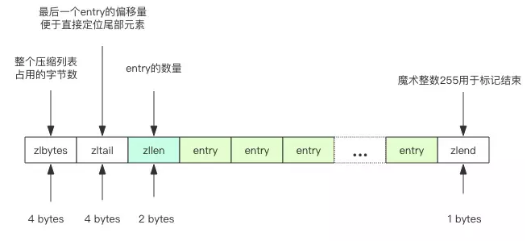

# 小对象压缩
---
Redis是一个非常耗内存的数据库，它所有的数据都放在内存里。如果我们不注意节约使用内存，Redis就会因为我们的无节制使用出现内存不足而崩溃。Redis作者为了优化数据结构的内存占用，也苦心孤诣增加了许多的优化点，这些优化也是以牺牲代码的可读性为代价的，但是毫无疑问这是非常值得的，尤其像Redis这种数据库。


## 32bit VS 64bit
---
Redis如果使用32bit进行编译，内部所有数据结构使用的指针空间占用会少一半，如果Redis的分配内存不超过4G，可以使用32bit进行编译，可以节约大量内存。4G的内存作为一些小型站点的缓存数据库是绰绰有余了，如果不足，还可以通过增加实例的方式来解决。

## 小对象存储(ziplist)
---
如果Redis内部管理的集合数据结构很小，它会使用紧凑存储形式压缩存储。

这就好比HashMap本身是二维结构，但是如果内部元素比较少，使用二维结构反而是浪费空间，还不如使用一维数组进行存储，需要查找时，因为元素少，进行遍历也很快，甚至可以必HashMap本身的查找还要快。比如下面可以使用数组来模拟HashMap的增删改操作。
```
public class ArrayMap<K, V> {

  private List<K> keys = new ArrayList<>();
  private List<V> values = new ArrayList<>();

  public V put(K k, V v) {
    for (int i = 0; i < keys.size(); i++) {
      if (keys.get(i).equals(k)) {
        V oldv = values.get(i);
        values.set(i, v);
        return oldv;
      }
    }
    keys.add(k);
    values.add(v);
    return null;
  }

  public V get(K k) {
    for (int i = 0; i < keys.size(); i++) {
      if (keys.get(i).equals(k)) {
        return values.get(i);
      }
    }
    return null;
  }

  public V delete(K k) {
    for (int i = 0; i < keys.size(); i++) {
      if (keys.get(i).equals(k)) {
        keys.remove(i);
        return values.remove(i);
      }
    }
    return null;
  }

}
```
Redis的ziplist是一个紧凑的字节数组结构，如下图所示，每个元素之间都是紧挨着的。我们不用过于关心`zlbytes/zltail`和`zlend`的含义，稍微了解一下就好。



如果它存储的是hash结构，那么key和value会作为两个entry相邻存在一起。
```
127.0.0.1:6379> hset hello a 1
(integer) 1
127.0.0.1:6379> hset hello b 2
(integer) 1
127.0.0.1:6379> hset hello c 3
(integer) 1
127.0.0.1:6379> object encoding hello
"ziplist"
```

如果它存储的是zset，那么value和score会作为两个entry相邻存在一起。
```
127.0.0.1:6379> zadd world 1 a
(integer) 1
127.0.0.1:6379> zadd world 2 b
(integer) 1
127.0.0.1:6379> zadd world 3 c
(integer) 1
127.0.0.1:6379> object encoding world
"ziplist"
```

Redis的`intset`是一个紧凑的整数数组结构，它用于存放元素都是整数并且元素个数较少的set结合。

如果整数可以用uint16表示，那么intset的元素就是16位的数组，如果新加入的元素超过了uint16表示的范围，那么就是要uint32表示，如果新加入的元素超过了uint32表示的范围，那么就使用uint64表示，Redis支持set集合动态从uint16升级到uint32，再升级到uint64.


```
127.0.0.1:6379> sadd hello 1 2 3
(integer) 3
127.0.0.1:6379> object encoding hello
"intset"
```

如果set里存储的是字符串，那么sadd立即升级问hashtable结构。
```
127.0.0.1:6379> sadd hello yes no
(integer) 2
127.0.0.1:6379> object encoding hello
"hashtable"
```

**存储界限**  
当集合对象的元素不断增加，或者某个value值过大，这种小对象存储也会被升级为标准结构。Redis规定在小对象存储结构的限制条件如下：
```
hash-max-ziplist-entries 512  # hash 的元素个数超过512就必须用标准结构存储
hash-max-ziplist-value 64  # hash 的任意元素的key/value 的长度超过64就必须用标准结构存储
list-max-ziplist-entries 512  # list 的元素个数超过512就必须用标准结构存储
list-max-ziplist-value 64  # list 的任意元素的长度超过64就必须用标准结构存储
zset-max-ziplist-entries 128  # zset 的元素个数超过128就必须用标准结构存储
zset-max-ziplist-value 64  # zset 的任意元素的长度超过64就必须用标准结构存储
set-max-intset-entries 512  # set 的整数元素个数超过512就必须用标准结构存储
```

接下来我们做一个小实验，看看这里的界限是不是真的起到作用了。
```
import redis
client = redis.StrictRedis()
client.delete("hello")
for i in range(512):
    client.hset("hello", str(i), str(i))
print client.object("encoding", "hello")  # 获取对象的存储结构
client.hset("hello", "512", "512")
print client.object("encoding", "hello") # 再次获取对象的存储结构
```
输出：
```
ziplist
hashtable
```

可以看出来当 hash 结构的元素个数超过 512 的时候，存储结构就发生了变化。

接下来我们再试试递增 value 的长度，在 Python 里面对字符串乘以一个整数 n 相当于重复 n 次。

```
import redis
client = redis.StrictRedis()
client.delete("hello")
for i in range(64):
    client.hset("hello", str(i), "0" * (i+1))
print client.object("encoding", "hello")  # 获取对象的存储结构
client.hset("hello", "512", "0" * 65)
print client.object("encoding", "hello") # 再次获取对象的存储结构
```
输出：
```
ziplist
hashtable
```
可以看出来当 hash 结构的任意 entry 的 value 值超过了 64，存储结构就升级成标准结构了。


## 内存回收机制
---
Redis 并不总是可以将空闲内存立即归还给操作系统。

如果当前 Redis 内存有 10G，当你删除了 1GB 的 key 后，再去观察内存，你会发现内存变化不会太大。原因是操作系统回收内存是以页为单位，如果这个页上只要有一个 key 还在使用，那么它就不能被回收。Redis 虽然删除了 1GB 的 key，但是这些 key 分散到了很多页面中，每个页面都还有其它 key 存在，这就导致了内存不会立即被回收。

不过，如果你执行 flushdb，然后再观察内存会发现内存确实被回收了。原因是所有的 key 都干掉了，大部分之前使用的页面都完全干净了，会立即被操作系统回收。

Redis 虽然无法保证立即回收已经删除的 key 的内存，但是它会重用那些尚未回收的空闲内存。这就好比电影院里虽然人走了，但是座位还在，下一波观众来了，直接坐就行。而操作系统回收内存就好比把座位都给搬走了。这个比喻是不是很 6？


## 内存分配算法
---
内存分配是一个非常复杂的课题，需要适当的算法划分内存页，需要考虑内存碎片，需要平衡性能和效率。

Redis 为了保持自身结构的简单性，在内存分配这里直接做了甩手掌柜，将内存分配的细节丢给了第三方内存分配库去实现。目前 Redis 可以使用 jemalloc(facebook) 库来管理内存，也可以切换到tcmalloc(google)。因为 jemalloc 相比 tcmalloc的性能要稍好一些，所以Redis默认使用了jemalloc。

```
127.0.0.1:6379> info memory
# Memory
used_memory:809608
used_memory_human:790.63K
used_memory_rss:8232960
used_memory_peak:566296608
used_memory_peak_human:540.06M
used_memory_lua:36864
mem_fragmentation_ratio:10.17
mem_allocator:jemalloc-3.6.0
```

通过`info memory`指令可以看到Redis的`mem_allocator`使用了`jemalloc`。

[扩展阅读](http://tinylab.org/memory-allocation-mystery-%C2%B7-jemalloc-a/)