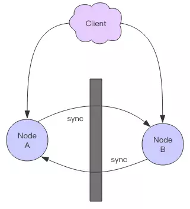
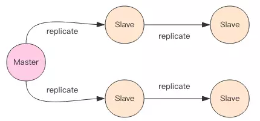
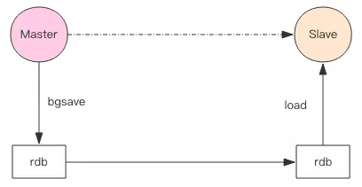

# 主从同步
---
很多企业都没有使用到Redis的集群，但是至少都做了主从。有了主从，当master挂掉的时候，运维让从库过来接管，服务就可以继续，否则master就需要经过数据恢复和重启的过程，这可能会拖长很长的时间，影响线上业务的持续服务。

了解Redis的主从复制之前，先了解一下现在分布式系统的理论基石——CAP原理。


## CAP原理
---
CAP原理是分布式存储的理论基石。
+ C-Consistent：一致性
+ A-Availability：可用性
+ P-Partition tolerate：分区容错

分布式系统的节点往往都是分布在不同的机器上进行网络隔离的，这意味着必然会有网络断开的风险，这个网络断开的场景的专业词汇叫做【网络分区】

在网络分区发生时，两个分布式节点之间不发进行通信，我们对一个节点进行的修改操作将无法同步到另外一个节点，所以数据的一致性将无法满足，因为两个分布式节点的数据不再保持一致。除非我们牺牲可用性，也就是暂停分布式节点服务，在网络分区发生时，不再提供修改数据的功能，知道网络状况完全恢复正常再继续对外提供服务。



一句话概括CAP原理就是：网络分区发生时，一致性和可用性两难全。


## 最终一致
---
Redis的主从数据是异步同步的，所以分布式的Redis系统并不满足一致性要求。当客户端在Redis的主节点修改了数据之后，立即返回，即使在主从网络断开的情况下，主节点依旧可以正常对外提供修改服务，所以Redis满足可用性。

Redis保证最终一致性，从节点会努力追赶主节点，最终从节点的状态会和主节点的状态保持一致。如果网络断开了，主从节点的数据将会出现大量不一致，一旦网络恢复，从节点会采用多种策略努力追赶上落后的数据，继续努力和主节点保持一致。


## 主从同步
---
Redis同步支持主从同步和从从同步，从从同步是Redis后续版本增加的功能，为了减轻主库的同步负担。



后面为了描述上的方便，统一理解为主从同步。

## 增量同步
---
Redis同步的是指令流，主节点会将那些对自己的状态产生修改性影响的指令记录在本地的内存buffer中，然后异步将buffer中的指令同步到从节点，从节点一边执行同步的指令流来达到和主节点一样的状态，一边向主节点反馈自己同步到哪里了（偏移量）。

因为内存的buffer是有限的，所以Redis主库不能将所有的指令都记录在内存buffer中。Redis的复制内存是一个定长的环形数组，如果数组内容满了，就会从头开始覆盖前面的内容。


如果因为网络状况不好，从节点在短时间内无法和主节点进行同步，那么当网络状况恢复时，Redis的主节点中那些没有同步的指令在buffer中有可能已经被后续的指令覆盖了，从节点将无法直接通过指令流来进行同步，这个时候就需要用到更加复杂的同步机制——快照同步。


## 快照同步
---
快照同步是一个非常耗资源的同步操作，它首先需要在主库上进行一次bgsave将当前内存的数据全部快找到磁盘文件中，然后再将快照文件的内容全部传送到从节点。从节点将快照文件接收完毕后，立即执行一次全量加载，加载之前要将当前内存的数据清空。加载完毕后通知主节点继续进行增量同步。

在整个快照同步进行的过程中，主节点的复制buffer还在不停的往前移动，如果快照同步的时间过长或者复制buffer太小，都会导致同步期间的同步指令在复制buffer中被覆盖，这样就会导致快照同步完成后无法进行增量复制，然后再次发起快照同步，如此极有可能发生快照同步的死循环。



所以务必配置一个合适的复制buffer大小参数，避免快照复制的死循环。


## 增加从节点
---
当从节点刚刚加入到集群时，它必须要进行一次快照同步，同步完成后再继续进行增量同步。


## 无盘复制
---
主节点在进行快照同步时，会进行很重的问价IO操作，特别是对于非SSD磁盘存储时，快照会对系统的负载产生很大的影响。特别是当系统正在进行AOF的fsync操作时，fsync将会被推迟执行，这就会严重影响主节点的服务效率。

所以从Redis2.8.18开始支持无盘复制。所谓无盘复制是指主服务器直接通过套接字将快照内容发送到从节点，生成快照是一个遍历的过程，主节点会一边遍历内存，一边将序列化的内容发送到从节点，从节点还是跟之前一样，先将接收到的内容存储到磁盘文件中，再进行一次性加载。


## Wait指令
---
Redis的复制是异步进行的，wai指令可以让异步复制变身同步复制，确保系统的强一致性（不严格）。wait指令是redis3.0版本以后才出现的。
```
> set key value
OK
> wait 1 0
(integer) 1
```
wait指令提供两个参数，第一个参数是从库的数量N，第二个参数是时间t，一毫秒为单位。它表示等待wait指令之前的所有写操作同步到N个从库（也就是确保N个从库的同步没有滞后），最多等待t。如果t=0，表示无限等待知道N个从库同步完成达成一致。

假设此时出现了网络分区，wait指令第二个参数时间t=0，主从同步无法继续进行，wait指令会永远阻塞，Redis服务将不可用。


## 小结
---
主从复制是 Redis 分布式的基础，Redis 的高可用离开了主从复制将无从进行。

不过复制功能也不是必须的，如果你将 Redis 只用来做缓存，跟 memcache 一样来对待，也就无需要从库做备份，挂掉了重新启动一下就行。但是只要你使用了 Redis 的持久化功能，就必须认真对待主从复制，它是系统数据安全的基础保障。