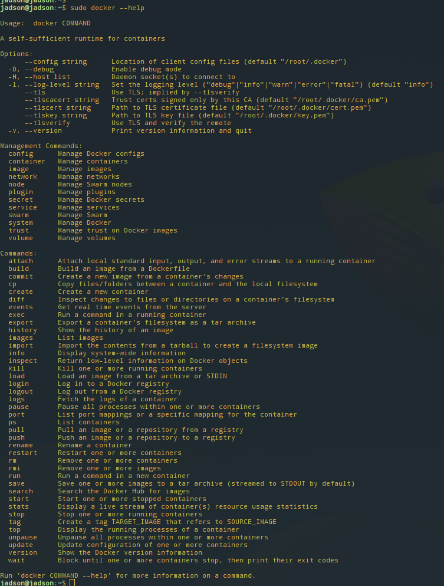

## 生命周期管理

+ **创建容器**
```
docker run IMAGE
```
> -a: 指定标准输入输出内容类型，可选 STDIN/STDOUT/STDERR 三项；  
> -d: 后台运行容器，并返回容器ID；  
> -i: 以交互模式运行容器，通常与 -t 同时使用；  
> -t: 为容器重新分配一个伪输入终端，通常与 -i 同时使用；  
> --name="nginx-lb": 为容器指定一个名称；  
> --dns 8.8.8.8: 指定容器使用的DNS服务器，默认和宿主一致；  
> --dns-search example.com: 指定容器DNS搜索域名，默认和宿主一致；  
> -h "mars": 指定容器的hostname；  
> -e username="ritchie": 设置环境变量；  
> --env-file=[]: 从指定文件读入环境变量；  
> --cpuset="0-2" or --cpuset="0,1,2": 绑定容器到指定CPU运行；  
> -m :设置容器使用内存最大值；  
> --net="bridge": 指定容器的网络连接类型，支持 bridge/host/none/container: 四种类型；  
> --link=[]: 添加链接到另一个容器；  
> --expose=[]: 开放一个端口或一组端口；  

+ **开始/停止/重启容器**
```
docker start/stop/restart CONTAINER
```

+ **删除容器**
```
docker rm CONTAINER
```
+ **杀掉一个运行中的容器**
```
docker kill CONTAINER
```
可选参数：
> -s :向容器发送一个信号

+ **暂停/恢复容器中的进程**
```
docker pause/unpause [OPTIONS] CONTAINER [CONTAINER...]
```

+ **创建新的容器**
```
docker create ：创建一个新的容器但不启动它
```
参数同`run`命令


+ **在运行的容器中执行命令**
```
docker exec [OPTIONS] CONTAINER COMMAND [ARG...]
```
可选参数：
> -d :分离模式: 在后台运行  
> -i :即使没有附加也保持STDIN 打开  
> -t :分配一个伪终端  


## 容器操作

+ **查看正在运行的容器**
```
docker ps
```
可选参数：
> -a :显示所有的容器，包括未运行的。  
> -f :根据条件过滤显示的内容。  
> --format :指定返回值的模板文件。  
> -l :显示最近创建的容器。  
> -n :列出最近创建的n个容器。  
> --no-trunc :不截断输出。  
> -q :静默模式，只显示容器编号。  
> -s :显示总的文件大小。  

+ **查看镜像/容器的信息**
```
docker inspect [OPTIONS] NAME|ID [NAME|ID...]
```
可选参数：
> -f,--format :指定返回值的模板文件。  
> -s :显示总的文件大小。  

+ **查看容器中运行的进程信息**
```
docker top [OPTIONS] CONTAINER [ps OPTIONS]
```

+ **从服务器获取实时事件**
```
docker events [OPTIONS]
```
可选参数：
> -f ：根据条件过滤事件；  
> --since ：从指定的时间戳后显示所有事件;  
> --until ：流水时间显示到指定的时间为止；

+ **获取容器的日志**
```
docker logs [OPTIONS] CONTAINER
```
可选参数：
> -f : 跟踪日志输出
> --since :显示某个开始时间的所有日志
> -t : 显示时间戳
> --tail :仅列出最新N条容器日志

+ **将容器导出**
```
docker export [OPTIONS] CONTAINER
```
可选参数：
> -o :将输入内容写到文件。如：docker export -o mysql-`date +%Y%m%d`.tar a404c6c174a2

+ ** 查看端口映射**
```
docker port [OPTIONS] CONTAINER [PRIVATE_PORT[/PROTO]]
```


## 容器命令

+ **从容器创建一个新的镜像**
```
docker commit [OPTIONS] CONTAINER [REPOSITORY[:TAG]]
```
参数说明：
> -a :提交的镜像作者；  
> -c :使用Dockerfile指令来创建镜像；  
> -m :提交时的说明文字；  
> -p :在commit时，将容器暂停。

+ **文件拷贝**
```
docker cp [OPTIONS] CONTAINER:SRC_PATH DEST_PATH
```
```
docker cp [OPTIONS] SRC_PATH CONTAINER:DEST_PATH
```

+ **检查容器里文件结构的更改**
```
docker diff [OPTIONS] CONTAINER
```

## 镜像仓库

+ **login/logout**
```
# 登录
docker login [OPTIONS] [SERVER]
# 登出
docker logout [OPTIONS] [SERVER]
```
参数：
> -u :登陆的用户名
> -p :登陆的密码

+ **拉取镜像**
```
docker pull ubuntu
```

+ **本地的镜像上传到镜像仓库(要先登陆到镜像仓库)**
```
docker push [OPTIONS] NAME[:TAG]
```
可选参数：
> --disable-content-trust :忽略镜像的校验,默认开启

+ **查找镜像**
```
docker search [OPTIONS] TERM
```
可选参数
> --automated :只列出 automated build类型的镜像；
> --no-trunc :显示完整的镜像描述；
> -s :列出收藏数不小于指定值的镜像。


## 本地镜像管理

+ **查看镜像**
```
docker images
```
可选参数：
> -a :列出本地所有的镜像（含中间映像层，默认情况下，过滤掉中间映像层）；
> --digests :显示镜像的摘要信息；
> -f :显示满足条件的镜像；
> --format :指定返回值的模板文件；
> --no-trunc :显示完整的镜像信息；
> -q :只显示镜像ID。


+ **删除镜像**
```
docker rmi IMAGE
```
可选参数：
> -f :强制删除；  
> --no-prune :不移除该镜像的过程镜像，默认移除；

+ **tag**
```
docker tag [OPTIONS] IMAGE[:TAG] [REGISTRYHOST/][USERNAME/]NAME[:TAG]
```

+ **build**
```
docker build [OPTIONS] PATH
```
可选参数：
> --build-arg=[] :设置镜像创建时的变量；
> --cpu-shares :设置 cpu 使用权重；
> --cpu-period :限制 CPU CFS周期；
> --cpu-quota :限制 CPU CFS配额；
> --cpuset-cpus :指定使用的CPU id；
> --cpuset-mems :指定使用的内存 id；
> --disable-content-trust :忽略校验，默认开启；
> -f :指定要使用的Dockerfile路径；
> --force-rm :设置镜像过程中删除中间容器；
> --isolation :使用容器隔离技术；
> --label=[] :设置镜像使用的元数据；
> -m :设置内存最大值；
> --memory-swap :设置Swap的最大值为内存+swap，"-1"表示不限swap；
> --no-cache :创建镜像的过程不使用缓存；
> --pull :尝试去更新镜像的新版本；
> -q :安静模式，成功后只输出镜像ID；
> --rm :设置镜像成功后删除中间容器；
> --shm-size :设置/dev/shm的大小，默认值是64M；
> --ulimit :Ulimit配置。

+ **查看镜像创建历史**
```
docker history [OPTIONS] IMAGE
```
可选参数：
> -H :以可读的格式打印镜像大小和日期，默认为true；
> --no-trunc :显示完整的提交记录；
> -q :仅列出提交记录ID。

+ **保存/加载镜像**
```
docker save|load [OPTIONS] IMAGE [IMAGE...]
```
可选参数：
> -o :输出到的文件。


> docker save保存的是镜像（image），docker export保存的是容器（container）；  
> docker load用来载入镜像包，docker import用来载入容器包，但两者都会恢复为镜像；  
> docker load不能对载入的镜像重命名，而docker import可以为镜像指定新名称。  


## 更多命令，通过`docker --help`查看




```
sudo docker images
```
