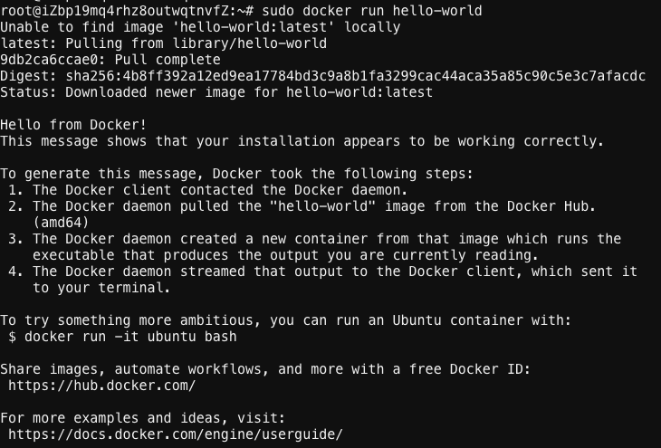

## 安装

[安装文档](https://docs.docker.com/install/#supported-platforms)

### ubuntu

+ 支持以下版本的64位操作系统
Bionic 18.04 (LTS)  
Artful 17.10  
Xenial 16.04 (LTS)  
Trusty 14.04 (LTS)  

+ 查看系统版本
```
uname -a
Linux iZbp19mq4rhz8outwqtnvfZ 4.4.0-117-generic #141-Ubuntu SMP Tue Mar 13 11:58:07 UTC 2018 x86_64 x86_64 x86_64 GNU/Linux
cat /proc/version
Linux version 4.4.0-117-generic (buildd@lgw01-amd64-029) (gcc version 5.4.0 20160609 (Ubuntu 5.4.0-6ubuntu1~16.04.9) ) #141-Ubuntu SMP Tue Mar 13 11:58:07 UTC 2018
```

+ 卸载旧版本
```
sudo apt-get remove docker docker-engine docker.io
```

#### 从仓库安装

+ 更新apt
```
sudo apt-get update
```
+ 安装证书
```
sudo apt-get install \
    apt-transport-https \
    ca-certificates \
    curl \
    software-properties-common
```

+ 添加官方密钥
```
curl -fsSL https://download.docker.com/linux/ubuntu/gpg | sudo apt-key add -
```

+ 将安装包添加至仓库
```
sudo add-apt-repository \
   "deb [arch=amd64] https://download.docker.com/linux/ubuntu \
   $(lsb_release -cs) \
   stable"
```

+ 安装
```
sudo apt-get update
sudo apt-get install docker-ce
```

+ 验证是否正确安装
```
sudo docker run hello-world
```



#### 下载deb包安装

+ [下载安装包]( https://download.docker.com/linux/ubuntu/dists/)
+ 安装
```
sudo dpkg -i /path/to/package.deb
```

## Deepin安装  
深度官方deepin的应用仓库已经集成了docker，不过类似docker-ce这种最新版。要想使用最新版可以参考官网 debian 安装教程安装，不过由于深度15.4基于 sid 版本开发，通过 $(lsb_release -cs) 获取的版本信息为 unstable，而docker官方源并没提供 sid 这种unstable版本的docker，所以使用官方教程是安装不成功的。

+ 如果以前安装过老版本，可以先卸载以前版本  
```
如果以前安装过老版本，可以先卸载以前版本
```
sudo apt-get remove docker.io docker-engine
```

+ 安装docker-ce与密钥管理与下载相关的工具  
```
sudo apt-get install apt-transport-https ca-certificates curl python-software-properties software-properties-common
```

+ 下载并安装密钥
```
curl -fsSL https://mirrors.ustc.edu.cn/docker-ce/linux/debian/gpg | sudo apt-key add -
// 官方源，能否成功可能需要看运气。
// curl -fsSL https://download.docker.com/linux/debian/gpg | sudo apt-key add -
```

+ 查看密钥是否安装成功
```
sudo apt-key fingerprint 0EBFCD88
```
如果安装成功，会出现如下内容：
```
pub   4096R/0EBFCD88 2017-02-22              Key fingerprint = 9DC8 5822 9FC7 DD38 854A  E2D8 8D81 803C 0EBF CD88  
  uid     Docker Release (CE deb) <docker@docker.com>  
  sub   4096R/F273FCD8 2017-02-22
```

+ 添加docker官方仓库  
然后，我们需要向 source.list 中添加 Docker CE 软件源：
```
sudo add-apt-repository "deb [arch=amd64] https://mirrors.ustc.edu.cn/docker-ce/linux/debian  wheezy stable"
//官方源
// sudo add-apt-repository  "deb [arch=amd64] https://download.docker.com/linux/debian wheezy stable"
```
**Note**：这里例子的debian的版本代号是wheezy，应该替换成deepin基于的debian版本对应的代号，查看版本号命令：cat /etc/debian_version，再根据版本号对应的代号替换上面命令的wheezy即可。

+ 更新仓库
```
sudo apt-get update
```

+ 安装docker-ce  
由于网络不稳定，可能会下载失败。如果下载失败了，可以多试几次或者找个合适的时间继续。
```
sudo apt-get install docker-ce
```
在安装完后启动报错，查看docker.service的unit文件，路径为/lib/systemd/system/docker.service，把ExecStart=/usr/bin/dockerd -H fd:// 修改为ExecStart=/usr/bin/dockerd，则可以正常启动docker,启动 命令为
```
systemctl start docker
```

+ 查看安装的版本信息
```
docker version
```

+ 验证docker是否被正确安装并且能够正常使用
```
sudo docker run hello-world
```

## 更换国内docker加速器

**方法1: 使用阿里云的docker加速器**
+ 在阿里云申请一个账号
打开连接 https://cr.console.aliyun.com/#/accelerator 拷贝您的专属加速器地址。

+ 修改修改daemon配置文件/etc/docker/daemon.json来使用加速器(下面是4个命令，分别单独执行)
注意 这里的https://jxus37ad.mirror.aliyuncs.com是申请者的加速器地址，在此仅仅用于演示，而使用者要个根据自己的使用的情况填写自己申请的加速器地址。
```
sudo mkdir -p /etc/docker
sudo tee /etc/docker/daemon.json <<-'EOF'
{
  "registry-mirrors": ["https://jxus37ad.mirror.aliyuncs.com"]
}
EOF
sudo systemctl daemon-reload
sudo systemctl restart docker
```

**方式二：使用docker-cn提供的镜像源**
+ 编辑/etc/docker/daemon.json文件，并输入docker-cn镜像源地址
```
sudo nano /etc/docker/daemon.json
```
输入以下内容
```
{
  "registry-mirrors": ["https://registry.docker-cn.com"]
}
```

+ 重启docker服务
