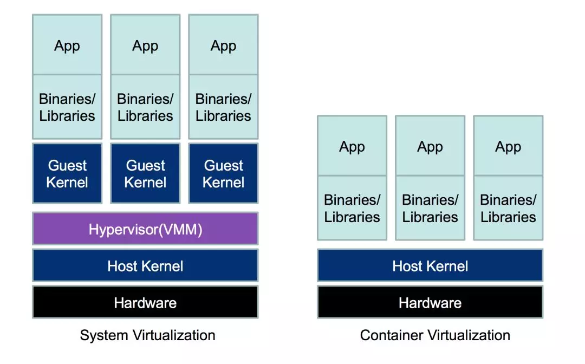

## 什么是Docker？

Docker属于Linux容器的一种封装，提供简单已用的容器使用接口。它是目前最流行的Linux容器解决方案。Docker将应用程序与改程序的依赖，打包在一个文件里。运行这个文件，就会生成一个虚拟容器。程序在这个虚拟容器里运行，就好像在真实的物理机上运行一样。有了Docker，就不用担心环境的问题。

总体来说，Docker的借口相当简单，用户可以方便地创建和使用容器，把自己的应用放入容器。容器还可以进行版本管理、复制、分享、修改，就像管理普通的代码一样。

## 为什么要使用Docker?

+ **更快速的交付和部署**  
对开发和运维来说，最希望的就是一次创建或配置，可以在任意地方正常运行。  
开发者可以使用一个标准的镜像来构建一套开发容器，开发完成之后，运维人员可以直接使用这个容器来部署代码。 Docker 可以快速创建容器，快速迭代应用程序，并让整个过程全程可见，使团队中的其他成员更容易理解应用程序是如何创建和工作的。 Docker 容器很轻很快！容器的启动时间是秒级的，大量地节约开发、测试、部署的时间。

+ **更高效的虚拟化**  
Docker容器的运行不需要额外的hypervisor，它是内核级的虚拟化，因袭可以实现更高的性能和效率。

+ **更轻松的迁移和扩展**  
Docker容器几乎可以在任意的平台上运行，包括物理机、虚拟机、公有云、私有云、个人电脑、服务器等。这种兼容性可以让用户把一个应用程序从一个平台直接迁移到另一个平台。

+ **更简单的管理**  
使用Docker，只需要小小的修改，就可以替代以往大量的更新工作。所有的修改都以增量的方式被分发和更新，从而实现自动化并且高效的管理。

## 容器与虚拟机

VM是一个运行在宿主机之上的完整的操作系统，VM运行自身操作系统会占用较多的CPU、内存、硬盘资源。Docker不同于VM，只包含应用程序以及依赖库，基于libcontainer运行在宿主机上，并处于一个隔离的环境中，这使得Docker更加轻量高效，启动容器只需几秒钟之内完成。由于Docker轻量、资源占用少，使得Docker可以轻易的应用到构建标准化的应用中。但Docker目前还不够完善，比如隔离效果不如VM，共享宿主机操作系统的一些基础库等；网络配置功能相对简单，主要以桥接方式为主；查看日志也不够方便灵活。  

Docker 在容器的基础上，进行了进一步的封装，从文件系统、网络互联到进程隔离等等，极大的简化了容器的创建和维护。使得 Docker 技术比虚拟机技术更为轻便、快捷。  

作为一种新兴的虚拟化方式，Docker 跟传统的虚拟化方式相比具有众多的优势。Docker 容器的启动可以在秒级实现，这相比传统的虚拟机方式要快得多；Docker 对系统资源的利用率很高，一台主机上可以同时运行数千个 Docker 容器。

## 容器与镜像

+ **Docker 镜像(Images)**: Docker 镜像是用于创建 Docker 容器的模板。

+ **Docker 容器(Container)**: 容器是独立运行的一个或一组应用。

+ **Docker 客户端(Client)**: Docker 客户端通过命令行或者其他工具使用 [Docker API](https://docs.docker.com/reference/api/docker_remote_api) 与 Docker 的守护进程通信。

+ **Docker 主机(Host)**: 一个物理或者虚拟的机器用于执行 Docker 守护进程和容器。

+ **Docker 仓库(Registry)**: Docker 仓库用来保存镜像，可以理解为代码控制中的代码仓库。[Docker Hub](https://hub.docker.com) 提供了庞大的镜像集合供使用。

+ **Docker Machine**: Docker Machine是一个简化Docker安装的命令行工具，通过一个简单的命令行即可在相应的平台上安装Docker，比如VirtualBox、 Digital Ocean、Microsoft Azure。

+ 可以采用类比法

| Docker | 面向对象 |
|----|----|
|镜像|类|
|容器|对象|
