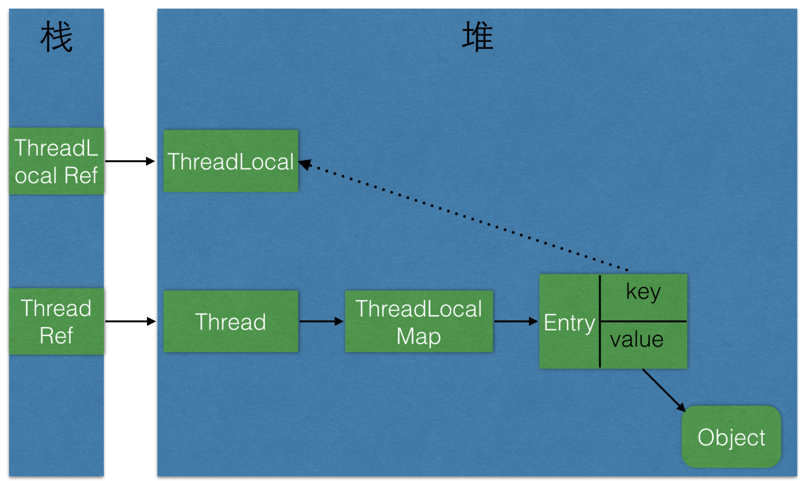

# ThreadLocal
---


## ThreadLocal是什么 ？
---
`ThreadLocal`是线程局部变量，和普通变量的不同在于：**每个线程持有这个变量的一个副本，可以独立修改(set方法)和访问(get方法)这个变量，并且线程之间不会发生冲突。`ThreadLocal`一般会被`private static`修饰**

所以，`ThreadLocal`与线程同步机制不同，线程同步机制是多个线程共享同一个变量，而`ThreadLocal`是为每一个线程创建一个单独的变量副本，故而每个线程都可以单独地改变自己所拥有的变量副本，而不会影响其他线程所对应的副本。可以说`ThreaddLocal`为多线程环境下变量问题提供了另外一种解决思路。


`ThreadLocal`定义了4个方法：
+ `get()`：返回变量在当前线程中的值
+ `initialValue()`：返回变量在当前线程的初始值
+ `remove()`：移除变量在当前线程的值
+ `set(T value)`：设置变量在当前线程的值  

除了这4个方法，ThreadLocal内部还有一个静态内部类ThreadLocalMap，该内部类才是实现线程隔离机制的关键，get()、set()、remove()都是基于该内部类操作。ThreadLocalMap提供了一种用键值对方式存储每一个线程的变量的方法，key为当前ThreaddLocal对象，value则是对应线程的变量副本。

对于ThreadLocal需要注意的有亮点：
+ ThreadLocal示例本身不存储值，它只是提供了一个在当前线程中找到副本值的key
+ 是ThreadLocal包含在Thread中，而不是Thread包含在ThreadLocal中

下图是Thread、ThreadLocal、ThreadLocalMap的关系：




## ThreadLocal使用示例
---
```
public class SeqCount {
    private static ThreadLocal<Integer> seqCount = new ThreadLocal<Integer>() {
        // 实现initialValue()
        @Override
        public Integer initialValue() {
            return 0;
        }
    };


    public int nextSeq() {
        seqCount.set(seqCount.get() + 1);
        return seqCount.get();
    }


    public static void main(String[] args) {
        SeqCount seqCount = new SeqCount();
        SeqThread thread1 = new SeqThread(seqCount);
        SeqThread thread2 = new SeqThread(seqCount);
        SeqThread thread3 = new SeqThread(seqCount);
        SeqThread thread4 = new SeqThread(seqCount);

        thread1.start();
        thread2.start();
        thread3.start();
        thread4.start();
    }


    private static class SeqThread extends Thread {
        private SeqCount seqCount;
        SeqThread(SeqCount seqCount) {
            this.seqCount = seqCount;
        }

        @Override
        public void run() {
            for (int i = 0; i < 3; i++) {
                System.out.println(Thread.currentThread().getName() + " seqCount :" + seqCount.nextSeq());
            }
        }
    }
}
```
运行结果：
```
Thread-0 seqCount :1
Thread-1 seqCount :1
Thread-1 seqCount :2
Thread-1 seqCount :3
Thread-0 seqCount :2
Thread-0 seqCount :3
Thread-2 seqCount :1
Thread-2 seqCount :2
Thread-2 seqCount :3
Thread-3 seqCount :1
Thread-3 seqCount :2
Thread-3 seqCount :3

Process finished with exit code 0
```
从运行结果可以看出，ThreadLocal确实可以达到线程隔离机制，确保变量的安全性。

## ThreadLocal源码解析
---
ThreadLocal虽然解决了多线程变量的复杂问题，但是它的源码却是比较简单的。ThreadLocalMap是实现ThreadLocal的关键。

### ThreadLocalMap
---
ThreadLocalMap内部利用Entry来实现key-value的存储，如下：
```
/**
* The entries in this hash map extend WeakReference, using
* its main ref field as the key (which is always a
* ThreadLocal object).  Note that null keys (i.e. entry.get()
* == null) mean that the key is no longer referenced, so the
* entry can be expunged from table.  Such entries are referred to
* as "stale entries" in the code that follows.
*/
static class Entry extends WeakReference<ThreadLocal<?>> {
    /** The value associated with this ThreadLocal. */
    Object value;

    Entry(ThreadLocal<?> k, Object v) {
        super(k);
        value = v;
    }
}
```
从上面代码中可以看出，Entry的key就是ThreadLocal，而value就是值。同时，Entry也继承WeakReference，所以说Entry所对应的key（ThreadLocal实例）的引用为一个弱引用。

ThreadLocalMap的源码稍微多了点，这里只看两个最核心的方法getEntry()、set(ThreadLocal key, Object value):  

**`set(ThreadLocal key, Object value)`**

```
/**
* Set the value associated with key.
*
* @param key the thread local object
* @param value the value to be set
*/
private void set(ThreadLocal<?> key, Object value) {

    // We don't use a fast path as with get() because it is at
    // least as common to use set() to create new entries as
    // it is to replace existing ones, in which case, a fast
    // path would fail more often than not.

    Entry[] tab = table;
    int len = tab.length;
    // 根据 ThreadLocal 的散列值，查找对应元素在数组中的位置
    int i = key.threadLocalHashCode & (len-1);

    // 采用“线性探测法”，寻找合适位置
    for (Entry e = tab[i];
            e != null;
            e = tab[i = nextIndex(i, len)]) {
        ThreadLocal<?> k = e.get();

        // key 存在，直接覆盖
        if (k == key) {
            e.value = value;
            return;
        }

        // key == null，但是存在值（因为此处的e != null），说明之前的ThreadLocal对象已经被回收了
        if (k == null) {
            // 用新元素替换陈旧的元素
            replaceStaleEntry(key, value, i);
            return;
        }
    }


    // ThreadLocal对应的key实例不存在也没有陈旧元素，new 一个
    tab[i] = new Entry(key, value);
    int sz = ++size;

    // cleanSomeSlots 清楚陈旧的Entry（key == null） 
    // 如果没有清理陈旧的 Entry 并且数组中的元素大于了阈值，则进行 rehash
    if (!cleanSomeSlots(i, sz) && sz >= threshold)
        rehash();
}
```


[参考](https://mp.weixin.qq.com/s/O7LrEgDKZsHGi0y69xowkg)