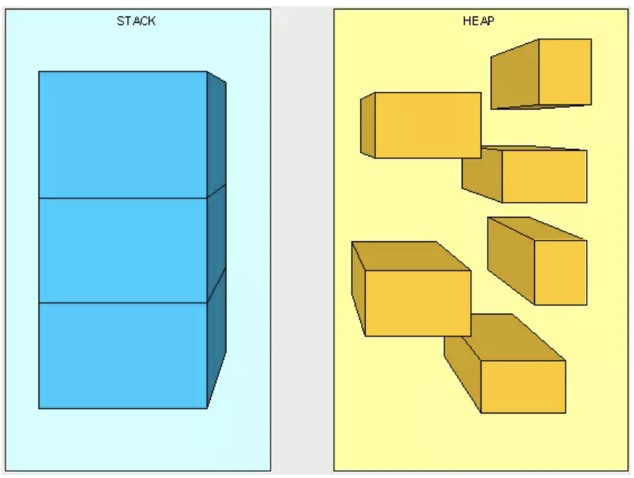

# Java虚拟机1:基本概念

## 数据类型
---
Java虚拟机中，数据类型可以分为2类：基本类型和引用类型。
+ 基本类型的变量保存原始值，即：它代表得到值就是数值本身。
+ 引用类型的变量保存的值是应用值。“引用值”代表了某个对象的引用，而不是对象本身，而对象本身存放在这个引用值所表示的地址的位置。
+ 基本类型包括：byte,short,int,long,char,float,double。
+ 引用类型包括：类类型、接口类型和数组。

## 堆与栈
---
堆和栈是程序运行的关键，很有必要把它们多得多关系说清楚。

**栈是运行时单位，而堆是存储的单位**

栈解决程序的运行问题，即程序如何执行，或者说如何处理数据；堆解决的是数据存储的问题，即数据怎么放、放在哪儿。

在Java中一个线程就会有一个线程栈与之对应，这点很容易理解，因为不同的线程执行逻辑有所不同，因此需要一个独立的线程栈。而堆则是所有线程共享的。

栈因为是运行单位，因此里面存储的信息都是跟当前线程（或程序）相关的信息。包括局部变量、程序运行状态、方法返回值等、而堆只负责存储对象信息。

**为什么要把堆和栈区分出来呢，栈中不是也可以存储数据吗？**
+ 第一，从软件设计的角度看，栈代表了处理逻辑，而堆代表了数据。这样分开，使得处理逻辑更为清晰。分而治之的思想。这种隔离、模块化的思想在软件设计的方方面面都有体现。

+ 第二，堆与栈的分离，是得是的堆中的内容会被多个线程共享（即多个线程可以同时访问同一个对象）。这种共享的好处是很多的。一方面这种共享提供了一种有效的数据交互方式（如：共享内存），另一方面，堆中的共享常量和缓存可以被所有栈访问，节省了空间。

+ 第三，因为栈运行时的需要，比如保存系统运行时的上下文，需要进行地址段的划分。由于栈只能向上增长，因此就会限制住栈存储内容的能力。而堆不同，堆中的对象是是可以根据需要动态增长的，因此栈和堆的拆分，使得动态增长成为可能，相应栈中只需记录堆中的一个地址即可。

+ 第四，面向对象就是堆和栈的完美结合。其实，面向对象方式的程序与以前结构化的程序在执行上没有任何区别。但是，面向对象的引入，使得对待问题的思考方式发生了改变，而更接近于自然方式的思考。当我们把对象拆开，你会发现，对象的属性其实就是数据，存放在堆中；而对象的行为（方法），就是运行逻辑，放在栈中。我们在编写对象的时候，其实即编写了数据结构，也编写的处理数据的逻辑。不得不承认，面向对象的设计，确实很美。

在 Java 中，main 函数就是栈的起始点，也是程序的起始点。

程序要运行总是有一个起点的。同 C 语言一样，java 中的 main 就是那个起点。无论什么 java 程序，找到 main 就找到了程序执行的入口。

**堆中存什么？栈中存什么？**

堆中存的是对象。栈中存的是基本数据类型和堆中对象的引用。一个对象的大小是不可估计的，或者说是可以动态变化的，但是在栈中，一个对象只对应了一个4btye的引用（堆栈分离的好处：））。

为什么不把基本类型放堆中呢？因为其占用的空间一般是1~8个字节——需要空间比较少，而且因为是基本类型，所以不会出现动态增长的情况——长度固定，因此栈中存储就够了，如果把他存在堆中是没有什么意义的（还会浪费空间，后面说明）。

可以这么说，基本类型和对象的引用都是存放在栈中，而且都是几个字节的一个数，因此在程序运行时，他们的处理方式是统一的。但是基本类型、对象引用和对象本身就有所区别了，因为一个是栈中的数据一个是堆中的数据。最常见的一个问题就是，Java中参数传递时的问题。

Java中的参数传递时传值呢？还是传引用？
+ 1. 不要试图与C进行类比，Java中没有指针的概念
+ 2. 程序运行永远都是在栈中进行的，因而参数传递时，只存在传递基本类型和对象引用的问题。不会直接传对象本身。

明确以上两点后。Java在方法调用传递参数时，因为没有指针，所以它都是进行传值调用（这点可以参考C的传值调用）。因此，很多书里面都说Java是进行传值调用，这点没有问题，而且也简化的C中复杂性。

但是传引用的错觉是如何造成的呢？在运行栈中，基本类型和引用的处理是一样的，都是传值，所以，如果是传引用的方法调用，也同时可以理解为“传引用值”的传值调用，即引用的处理跟基本类型是完全一样的。

但是当进入被调用方法时，被传递的这个引用的值，被程序解释（或者查找）到堆中的对象，这个时候才对应到真正的对象。如果此时进行修改，修改的是引用对应的对象，而不是引用本身，即：修改的是堆中的数据。所以这个修改是可以保持的了。

对象，从某种意义上说，是由基本类型组成的。可以把一个对象看作为一棵树，对象的属性如果还是对象，则还是一颗树（即非叶子节点），基本类型则为树的叶子节点。程序参数传递时，被传递的值本身都是不能进行修改的，但是，如果这个值是一个非叶子节点（即一个对象引用），则可以修改这个节点下面的所有内容。

堆和栈中，栈是程序运行最根本的东西。程序运行可以没有堆，但是不能没有栈。而堆是为栈进行数据存储服务，说白了堆就是一块共享的内存。不过，正是因为堆和栈的分离的思想，才使得Java的垃圾回收成为可能。

Java中，栈的大小通过-Xss来设置，当栈中存储数据比较多时，需要适当调大这个值，否则会出现java.lang.StackOverflowError异常。常见的出现这个异常的是无法返回的递归，因为此时栈中保存的信息都是方法返回的记录点。

## Java对象的大小
---
基本数据的类型的大小是固定的，这里就不多说了。对于非基本类型的Java对象，其大小就值得商榷。

在Java中，一个空Object对象的大小是8byte，这个大小只是保存堆中一个没有任何属性的对象的大小。看下面语句：
```
Object ob = new Object();
```
这样在程序中完成了一个Java对象的生命，但是它所占的空间为：4byte+8byte。4byte是上面部分所说的Java栈中保存引用的所需要的空间。而那8byte则是Java堆中对象的信息。

因为所有的Java非基本类型的对象都需要默认继承Object对象，因此不论什么样的Java对象，其大小都必须是大于8byte。

有了Object对象的大小，我们就可以计算其他对象的大小了。
```
Class NewObject {

    int count;

    boolean flag;

    Object ob;

}
```
其大小为：空对象大小(8byte)+int大小(4byte)+Boolean大小(1byte)+空Object引用的大小(4byte)=17byte。但是因为Java在对对象内存分配时都是以8的整数倍来分，因此大于17byte的最接近8的整数倍的是24，因此此对象的大小为24byte。

这里需要注意一下基本类型的包装类型的大小。因为这种包装类型已经成为对象了，因此需要把他们作为对象来看待。包装类型的大小至少是12byte（声明一个空Object至少需要的空间），而且12byte没有包含任何有效信息，同时，因为Java对象大小是8的整数倍，因此一个基本类型包装类的大小至少是16byte。

这个内存占用是很恐怖的，它是使用基本类型的N倍（N>2），有些类型的内存占用更是夸张（随便想下就知道了）。因此，可能的话应尽量少使用包装类。在JDK5.0以后，因为加入了自动类型装换，因此，Java虚拟机会在存储方面进行相应的优化。

## 引用类型
---
对象引用类型分为强引用、软引用、弱引用和虚引用。

+ **强引用**：就是我们一般声明对象是时虚拟机生成的引用，强引用环境下，垃圾回收时需要严格判断当前对象是否被强引用，如果被强引用，则不会被垃圾回收

+ **软引用**：软引用一般被做为缓存来使用。与强引用的区别是，软引用在垃圾回收时，虚拟机会根据当前系统的剩余内存来决定是否对软引用进行回收。
> 如果剩余内存比较紧张，则虚拟机会回收软引用所引用的空间；如果剩余内存相对富裕，则不会进行回收。
> 换句话说，虚拟机在发生OutOfMemory时，肯定是没有软引用存在的。

+ **弱引用**：弱引用与软引用类似，都是作为缓存来使用。但与软引用不同，弱引用在进行垃圾回收时，是一定会被回收掉的，因此其生命周期只存在于一个垃圾回收周期内。

强引用不用说，我们系统一般在使用时都是用的强引用。而“软引用”和“弱引用”比较少见。他们一般被作为缓存使用，而且一般是在内存大小比较受限的情况下做为缓存。

因为如果内存足够大的话，可以直接使用强引用作为缓存即可，同时可控性更高。因而，他们常见的是被使用在桌面应用系统的缓存。
