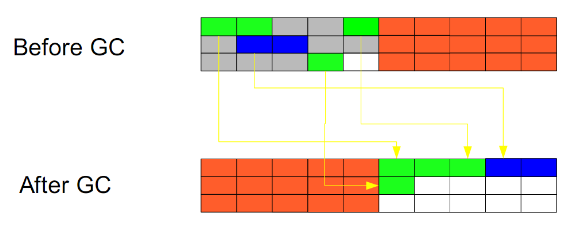

# Java虚拟机2:基本垃圾回收算法有哪些？
---
可以从不同的角度去划分垃圾回收算法。

## 按照基本回收策略分
### 引用计数（Reference Count）
比较古老的回收算法。原理是此对象有一个引用，即增加一个计数，删除一个引用，即减少一个计数。垃圾回收时，只收集计数为0的对象。此算法最致命的是无法回收循环引用的对象。

### 标记-清除（Mark-Sweep）
此算法执行分两个阶段。第一阶段从引用根节点开始标记所有被引用的对象，第二阶段遍历整个堆，把未标记的对象清除。此算法需要暂停整个应用，同时会产生内存碎片。

### 复制（Copying）
此算法把内存空间划分为两个相等得到内存区域，每次只是有一个内存区域。垃圾回收时，遍历当前使用的区域，把正在使用中的对象复制到另一个区域中。此算法只处理正在使用中的对象，因此复制成本比较小，同时复制过去之后还能进行相应的内存整理，不会出现碎片问题。当然，此算法的缺点也是很明显的，就是需要两倍的内存空间。

### 标记-整理（Mark-Compact）
此算法结合了“标记-清除”和“复制”两个算法的优点。也是分两阶段，第一阶段从根结点开始标记所有被引用的对象，第二阶段遍历整个堆，清除未标记对象并且把存活对象“压缩”到堆的另一块，按顺序排放.此算法避免了“标记-清除”的碎片问题，也避免了“复制”算法的空间问题。

## 按分区对待的方式分
+ **增量收集（Incremental Collecting）**：实时垃圾回收算法，即在应用进行的同时进行垃圾回收。不知道什么原因JDK5.0中的收集器没有使用这种算法的。
+ **分代收集（Generational Collecting）**：基于对对象生命周期分析后得出的垃圾收集算法。把对象分为“新生代”，“老年代”，“持久代”，对不同生命周期的对象使用不同的算法进行回收。现在的垃圾回收器都是使用此算法的。

## 按系统线程分
+ **串行执行**：串行收集使用单线程执行所有垃圾收集工作，因为无需多线程交互，实现容易，而且效率比较高。但是，其局限性也比较明显，即无法使用多处理器的优势。所以，此收集适合单处理器机器。
+ **并行执行**：并行收集使用多线程执行垃圾回收操作，因而速度快，效率高。而且理论上CPU数目越多，越能体现出并行收集器的优势。
+ **并发收集**：相对与串行收集和并行收集而言，前面两个在进行垃圾回收工作时，需要暂停整个运行环境，而只有垃圾回收程序在运行。因袭，系统在垃圾回收时会有明显暂停，而且暂停时间会因堆越大而越长。

[参考](https://pengjiaheng.iteye.com/blog/520228)
