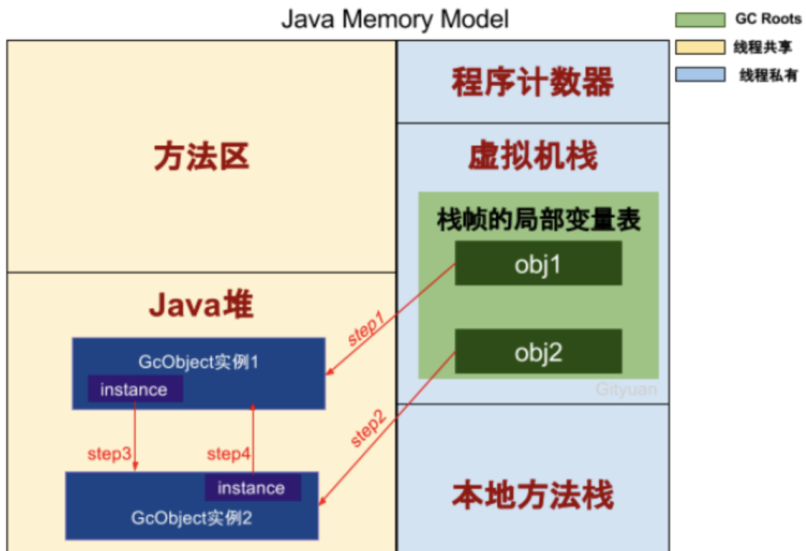
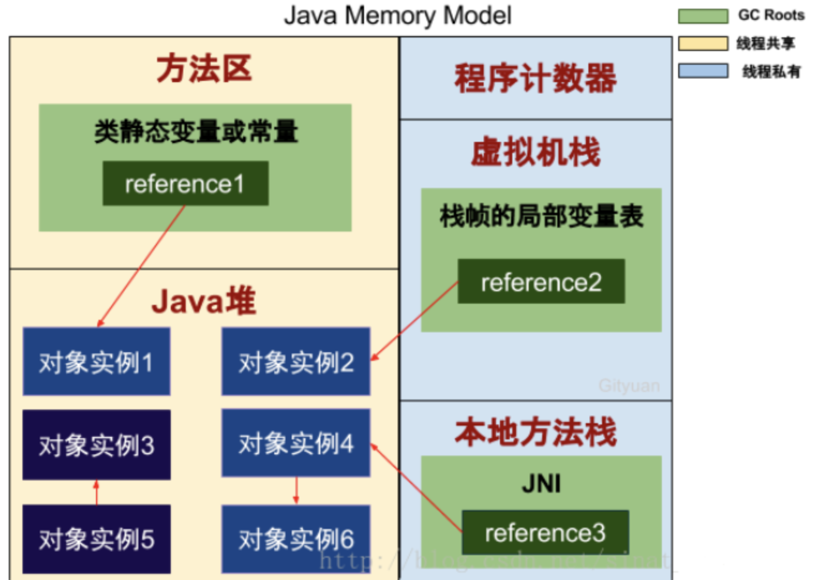

# Java虚拟机3:Java GC如何判断对象是否为垃圾？
---
查找内存中不再使用的对象。

## 引用计数

引用计数法就是如果一个对象没有被任何对象引用，则可视之为垃圾。这种方法的缺点就是不能解决循环引用的问题。  
下面通过一段代码来对比说明：
```
public class MyObject {
    public Object ref = null;
    public static void main(String[] args) {
        MyObject myObject1 = new MyObject();
        MyObject myObject2 = new MyObject();
        myObject1.ref = myObject2;
        myObject2.ref = myObject1;
        myObject1 = null;
        myObject2 = null;
    }
}
```
上述代码中myObject1和myObject2其实互相引用，他们的引用计数都为1，但是本身都是null,如果用引用计数法因为计数为1不会被GC回收，但他们本身为null，最终导致内存泄漏。

如果采用的是引用计数算法：

再回到前面代码GcDemo的main方法共分为6个步骤：
+ Step1：GcObject实例1的引用计数加1，实例1的引用计数=1；
+ Step2：GcObject实例2的引用计数加1，实例2的引用计数=1；
+ Step3：GcObject实例2的引用计数再加1，实例2的引用计数=2；
+ Step4：GcObject实例1的引用计数再加1，实例1的引用计数=2；

执行到Step 4，则GcObject实例1和实例2的引用计数都等于2。

接下来继续结果图：

+ Step5：栈帧中obj1不再指向Java堆，GcObject实例1的引用计数减1，结果为1；
+ Step6：栈帧中obj2不再指向Java堆，GcObject实例2的引用计数减1，结果为1。  

到此，发现GcObject实例1和实例2的计数引用都不为0，那么如果采用的引用计数算法的话，那么这两个实例所占的内存将得不到释放，这便产生了内存泄露。

## 根搜索算法

根搜索算法的基本思路就是通过一系列名为”GC Roots”的对象作为起始点，从这些节点开始向下搜索，搜索所走过的路径称为引用链(Reference Chain)，当一个对象到GC Roots没有任何引用链相连时，则证明此对象是不可用的。

这是目前主流的虚拟机都是采用GC Roots Tracing算法，比如Sun的Hotspot虚拟机便是采用该算法。 该算法的核心算法是从GC Roots对象作为起始点，利用数学中图论知识，图中可达对象便是存活对象，而不可达对象则是需要回收的垃圾内存。这里涉及两个概念，一是GC Roots，一是可达性。

那么可以作为GC Roots的对象（见下图）：
+ 虚拟机栈的栈帧的局部变量表所引用的对象；
+ 本地方法栈的JNI所引用的对象；
+ 方法区的静态变量和常量所引用的对象；

关于可达性的对象，便是能与GC Roots构成连通图的对象，如下图：

从上图，reference1、reference2、reference3都是GC Roots，可以看出：
+ reference1-> 对象实例1；
+ reference2-> 对象实例2；
+ reference3-> 对象实例4；
+ reference3-> 对象实例4 -> 对象实例6；

可以得出对象实例1、2、4、6都具有GC Roots可达性，也就是存活对象，不能被GC回收的对象。
而对于对象实例3、5直接虽然连通，但并没有任何一个GC Roots与之相连，这便是GC Roots不可达的对象，这就是GC需要回收的垃圾对象。  

再回过头来看看最前面的实例，GcObject实例1和实例2虽然从引用计数虽然都不为0，但从根搜索算法来看，都是GC Roots不可达的对象。

总之，对于对象之间循环引用的情况，引用计数算法，则GC无法回收这两个对象，而根搜索算法则可以正确回收。

[参考](https://www.cnblogs.com/hzzjj/p/6268432.html)
