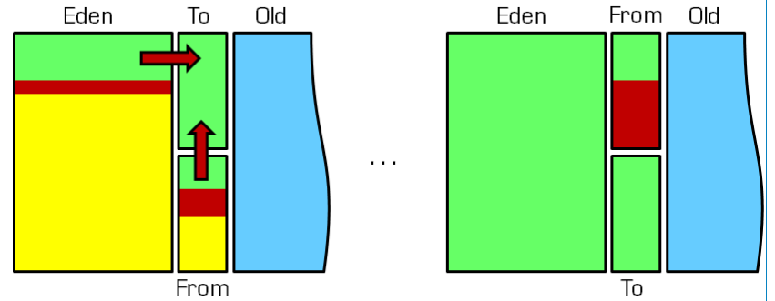

# Java虚拟机3：分代垃圾回收
---

## 为什么要分代
分代的垃圾回收策略，是基于这样一个事实：不同对象的生命周期是不一样的。因此，不同生命周期的对象可以采用不同的收集方式，以便提高回收效率。

在Java程序运行的过程中，会产生大量的对象，其中有一些对象是与业务信息相关，比如http请求中的Session对象、线程、Socket连接，这类对象跟业务直接挂钩，因此生命周期比较长。但还有一些对象，主要是线程运行过程中生成的临时变量，这些对象生命周期会比价短，比如：String对象，由于其不变类的特性，系统会产生大量的这些对象，有些对象甚至只用一次即可回收。

试想，在不进行对象存活时间区分的情况下，每次垃圾回收都是对整个堆空间进行回收，花费时间相对会长，同时，因为每次回收都需要遍历所有存活对象，但实际上，对于生命周期长的对象而言，这种遍历是没有效果的，因为可能进行了很多次遍历，但是他们一九存在。因此，分代垃圾回收采用分治的思想，进行代的划分，把不同生命周期的对象放在不同代上，不同代上采用最适合它的垃圾回收方式进行回收。

## 如何分代

如图所示：  
虚拟机中划分为3个代：年轻代（Young Generation）、老年代（Tenured Generation）和持久代（Permanent Generation）。其中持久代主要存放的是Java类的类信息，与垃圾收集器要手机的Java对象关系不大。年轻代和老年代的而划分是对垃圾手机影响比较大的。

### 年轻代
HotSpot JVM把年轻代分为了3部分：1个Eden区和2个Survivor区（分别叫from和to），默认比例为8：1。一般情况下，新创建的对象都会本分配到Eden区（一些大对象特殊处理）。这些对象经过第一次Minor GC后，如果仍然存活，将会被移到Survivor区。对象在Survivor区中每熬过一次Minor GC，年龄就会增加1岁，当它的年龄增加到一定程度时，就会被移动到老年代中。

因为年轻代中的对象基本上都是朝生夕死（80%以上），所以在年轻代的垃圾回收算法使用的是复制算法，复制算法的基本思想就是将内存分为2块，每次只是用其中一块，当这一块内存用完，就将还活着的对象复制到另一块上面。复制算法不会产生内存碎片。  

在GC开始的时候，对象只会存在Eden区和名为“From”的Survivor区，Survivor区“To”是空的。紧接着进行GC，Eden区中所有存活的对象都会被复制到“To”，而在“From”区中，仍存活的对象会根据他们的年龄来决定去向。年龄达到一定值（年龄阈值，可以通过-XX:MaxTenuringThreshold来设置）的对象会被移动到老年代中，没有达到阈值的对象会被复制到“To”区域。经过这次GC后，Eden区和From区已经被清空。这个时候，“From”和“To”会交换他们的角色，也就是新的“To”就是上次GC前的“From”，新的“From”就是上次GC前的“TO”。不管怎样，都会保证名为To的Survivor区域是空的。Minor G会一直重复这样的过程，直到“To”区域被填满，“To”区域被填满之后，会将所有对象移动到老年代中。

### 老年代
在年轻代中经理了N次垃圾回收后仍然存活的对象，就会被放到老年代中。因此，可以认为老年中存放的都是一些生命周期比较长的对象。

### 持久代
用于存放静态文件，如Java类、方法等。持久代对垃圾回收没有显著影响，但是有些应用可能动态生成或者调用一些class，例如Hibernate等，在这种时候需要设置一个比较大的持久代空间来存放资额蟹运行过程中新增的类。持久代大小通过`-XX:MaxPermSize=<N>`进行设置。

## 什么情况写触发垃圾回收
由于对象进行了分代处理，因此垃圾回收区域、时间也不一样。GC有两种类型：Scavenge GC和Full GC。

+ **Scavenge GC**：一般情况下，当新对象生成，并且在Eden申请空间失败时，就会触发Scavenge GC，对Eden区域进行GC，清除非存活对象，并且把尚且存活的对象移动到Survivor区域（To区域），然后整理Survivor的两个区。这种方式的GC时对年轻代Eden区进行的，不影响老年代。因为大部分对象都是从Eden区开始的，同时Eden区不会分配的很大，所以Eden区的GC就会频繁进行。因而，一般在这里需要使用速度快、效率高的算法，使Eden区能尽快空闲出来。

+ **Full GC**：对整个对进行整理，包括Young、Tenured和Perm。Full GC因为需要对整个对进行回收，所以比Scavenge GC要慢，所以应该尽可能减少Full GC的次数。

[参考1](https://pengjiaheng.iteye.com/blog/524024)
[参考2](https://blog.csdn.net/ft305977550/article/details/78517372)
